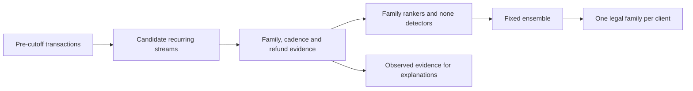

# UBS: next recurring merchant family

## Stream-time research branch

This branch investigates only `research/import-v2-stream-identity` at
`e4aa4c58175242e198cefd32d6ac4558145523af`. Start with the
[stream-time investigation](reports/stream_time_audit/README.md), including
the frozen protocol, source audit, paired TRAIN experiments, model attribution
and an evidence-based pitch. New research helpers do not replace the production
predictor or the frozen submission. The historical baseline below is preserved.

While the study ran, the same source branch advanced to `d5dddfd`. Its updated
README classifies the historical 0.619493 result as **INVALID under a strict
no-VALID-informed-selection requirement**. It remains a development result,
not an untouched holdout claim. See the investigation's source-update note;
the new experiments are explicitly pinned to `e4aa4c5`.

**Historical development-validation result: 0.619493 macro-F1, 0.647 accuracy,
all 1,000 clients and all eight classes; exposed to model selection.
The 0.80 research objective was not reached.** Two independent
raw-data builds reproduced every prediction and probability exactly.

This is a fresh implementation of the [official UBS 2026 challenge](https://github.com/UBS-AG/Swiss-AI-Weeks/blob/796d5805ec5f8a228a3ec0de36a2b4e6e1b1a1df/hackathons/2026/challenge.md).
Given a client's transactions before **2026-01-01**, predict the next recurring
merchant family in the following **90 days**: cloud, gym, insurance, mobile,
music, software, streaming, or none. Macro-F1 is the selection metric.

The [validated submission](submissions/submission.csv) contains exactly the
1,000 required test IDs. It has been generated and checked, **not uploaded** to
the challenge. No hidden-test score is available.

## Findings and final approach

The central difficulty is distribution shift. Descriptions and merchant codes
are substantially noisier in validation/test than in training. Feature-only
adversarial validation distinguished train from validation/test at AUC
0.960/0.976. An ordinary-CV winner scored 0.6851 OOF but collapsed to 0.1772 on
official validation. Ordinary random CV alone was misleading.

The final system reconstructs approximate recurring streams using amount,
currency, merchant templates and MCC evidence. It measures cadence, calendar
phase, recency and matching refunds; compares eight family candidates; and
uses a dedicated none detector. Independent unlabeled histories provide soft
family price profiles. Fixed text/MCC corruption views make training more
representative of the observed deployment noise.



The ensemble gives 75% weight to three seeded compact LightGBM rankers with
separate none classifiers, and 25% to three complementary robustness rankers
(two LightGBM, one XGBoost). These are six experts / nine fitted estimators.
All seeds (42, 17, 2026) are retained. The final decision is argmax; fitted
class biases failed the first external check and were rejected.

## Evidence and validation

| Evaluation | Macro-F1 | Interpretation |
|---|---:|---|
| Final original train OOF | 0.655305 | Exploratory five-fold client CV |
| Final valid-like corruption OOF | 0.637367 | Train-side robustness diagnostic |
| Final test-like corruption OOF | 0.613157 | Harsher train-side diagnostic |
| **Final official validation** | **0.619493** | Frozen external check, reproduced |

The official-validation client-bootstrap 95% interval is **0.5859–0.6500**.
It conditions on the fitted model and this sample; it does not capture all
selection uncertainty or hidden-test shift. The holdout was accessed in two
frozen candidate batches, then once for exact reproduction. It is therefore
not a pristine never-seen test set. Every access is recorded. Validation
labels were never used for supervised fitting, feature construction, or
decision calibration. Test labels were unavailable.

CV splits by client; all augmented copies stay in that client's training fold.
Every client receives all eight candidates. IDs and row ordering are excluded
from predictive features. The final supervised models use only the 2,000
training clients. Input hashes, pre-cutoff timestamps, cross-split overlap and
the submission contract are checked.

There are **95 executed evaluation records**, including explicitly marked
auxiliary-task and decision-fit diagnostics. These are not 95 independent
confirmatory tests. The 0.7698 auxiliary historical-task result is **not** a
challenge score. Full precision/recall/F1, confusion matrices, class frequencies,
calibration, parameters, seeds and timing are preserved.

- [Final results and per-class metrics](reports/final_results.md)
- [Frozen-model error analysis](reports/final_error_analysis.md)
- [Executed experiment log](reports/experiment_log.md) and [full records](reports/experiment_results.jsonl)
- [Data forensics](reports/data_forensics.md), [drift evidence](reports/distribution_shift.json), [cadence audit](reports/cadence_audit.json)
- [Frozen final protocol](reports/final_protocol.md), [holdout access log](reports/holdout_access_log.jsonl), [reproduction evidence](reports/reproduction.json)
- [Leakage and completion audit](reports/leakage_audit.md)
- [Accepted/rejected hypotheses and remaining work](reports/research_decisions.md)

## Reproduce

Tested on Windows 11, Python 3.13.7, with the package versions in
`requirements-lock.txt`. Python >=3.11 is declared; use the tested environment
for the closest numerical reproduction. The reported XGBoost run used CUDA on
an NVIDIA RTX 3060 Laptop GPU (6 GB, driver 610.78); each full training build
took about six minutes. LightGBM uses four CPU threads. CPU mode can differ numerically
from the recorded GPU result.

From the repository root:

```powershell
python -m venv .venv
.venv\Scripts\Activate.ps1
python -m pip install -r requirements-lock.txt
python -m pip install -e ".[dev]"
python scripts/prepare_data.py
python -m pytest -q
python -X utf8 scripts/run_pipeline.py --run-name reproduce_01 --device cuda
```

On a machine without CUDA, replace `--device cuda` with `--device cpu`.
The runner downloads the pinned 18.7 MB official archive when needed; its
SHA-256 and all seven extracted file hashes are verified. Raw data, models
and caches are ignored by Git. Both final research runs rebuilt features from
raw JSONL and refit all estimators; neither reused cached features or predictions.

The runner creates `outputs/reproduce_01/` containing the model, validation
metrics, evidence features, and checked test submission. Rerun the same command
to resume completed stages, whose checksums are verified. Interrupted training
restarts; completed training is preserved. A new run name starts a clean build.
Evaluation necessarily reads the supplied validation labels after predictions
are written and logs that access. No upload or external banking action occurs.

The individual commands are also available. Use a new output-directory basename
for each evaluation, since experiment IDs are immutable:

```powershell
python -X utf8 -m ubs_recurrence.cli train --output outputs/my_model --device cuda
python -X utf8 -m ubs_recurrence.cli evaluate --model outputs/my_model/model.joblib --output outputs/my_eval
python -X utf8 -m ubs_recurrence.cli submit --model outputs/my_model/model.joblib --output outputs/my_submission
```

Each prediction run writes normalized scores and actual extracted evidence.
Submission generation verifies exact IDs, required column names, uniqueness,
missing values and legal labels before and after CSV serialization.

## Research structure

```text
src/ubs_recurrence/   Data contracts, features, stream discovery, models, CLI
scripts/             Acquisition, audits, CV experiments, selection, reporting
tests/               Alignment, metrics, deterministic transforms, resumability
reports/             Committed findings, complete metrics and provenance
submissions/         Small validated submission and checksum receipt
data/                Ignored raw inputs and caches
outputs/             Ignored predictions, fitted models and experiment artifacts
```

`scripts/` keeps the executed hypothesis-specific research scripts. They are
not all independent entry points: several consume earlier feature caches.
Use the raw-data CLI above for final reproduction. For forensic tables:

```powershell
python scripts/audit_data.py
python scripts/forensic_streams.py
python scripts/audit_relationships.py
python scripts/calendar_audit.py
```

Historical experiment IDs refuse overwrites. The committed full result ledger
is sufficient to inspect all reported metrics without rerunning the search;
local detailed predictions remain in ignored experiment directories.

## Limits and banking interpretation

Software, streaming and music remain weakest (F1 about 0.56–0.57). Confusion
with none is common, and test data appears noisier still. The exact synthetic
target generator and future cancellations are not disclosed. Amount groups
are approximate streams; matching refunds do not prove cancellation. Model
scores are not guaranteed calibrated probabilities. No mathematical ceiling
or impossibility of 0.80 has been established.

The proposed banking use is to surface possible upcoming payment families for
reminders, subscription reviews and planning support. Exact payment dates,
amounts, real-client performance and business impact have not been validated.
[Observed explanation examples](reports/explanations.md) use actual model
inputs. The [jury brief](reports/jury_story.md) maps the work to the official
qualitative criteria and describes the autonomous research loop honestly;
inference is a prediction pipeline, not an autonomous banking-action agent.
