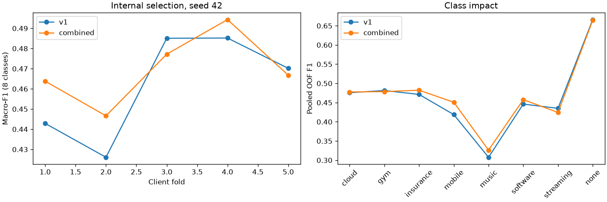
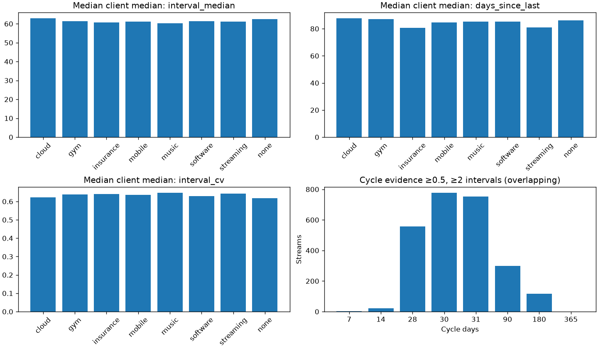
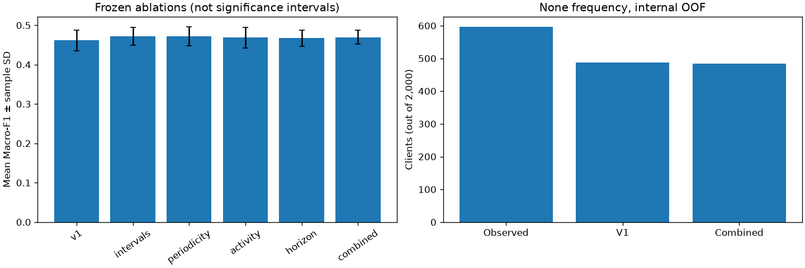
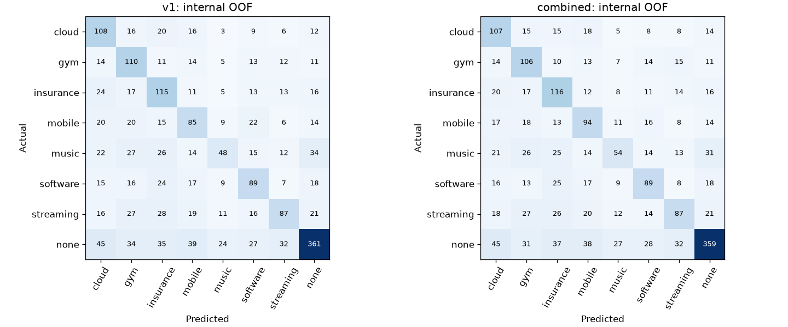

# Team Handoff — Temporal / Recurrence

## 1. Scope

Responsabilidad: temporalidad y recurrencia, en `features/ginestar-v2-temporal`.
Se analiza el desarrollo existente; no se integra un modelo nuevo. La entrega
sirve a los seis compañeros y a la IA que construirá la V2 conjunta.
No se desarrollan texto, embeddings, tuning general, dashboards ni cambios del
pipeline competitivo. No se incorporan ramas ajenas, no se modifica main y no
se abre PR. `scripts/emergency_submission.py` queda intacto y sin seguimiento.

Convenciones de evidencia: **Observed** = dato o propiedad del código;
**Reproduced** = ejecución medida; **Hypothesis** = explicación no demostrada;
**Recommendation** = siguiente acción propuesta, no resultado obtenido.
La fecha del análisis es 24/09/2026; cutoff del dataset, 01/01/2026 UTC.

## 2. Baseline

**Reproduced:** runner `scripts/run_ubs_baseline.py`, sin modificarlo, en
`6ba131140bc7628ff4b47360b719238f1b4add7f`. Selecciona el heurístico de
recurrencia sobre los 1.000 clientes de valid oficial. Seed 42; train 2.000;
LR C=[0,3;1;3], pesos none/balanced, TF-IDF 2.500; CatBoost 350/6/0,05;
ventanas 7/14/30/60/90/180. Estos modelos solo se ejecutan para reproducir V1;
no se ajustan nuevas configuraciones.

Macro-F1 **0.271024266**; accuracy **0.266000**; 1.000 clientes. Tiempo **167.531 s**. CSV en memoria validado: 1000 clientes.

| Class | Precision | Recall | F1 | Support | Predicted |
| --- | --- | --- | --- | --- | --- |
| cloud | 0.200000 | 0.516854 | 0.288401 | 89 | 230 |
| gym | 0.325758 | 0.355372 | 0.339921 | 121 | 132 |
| insurance | 0.306306 | 0.343434 | 0.323810 | 99 | 111 |
| mobile | 0.272727 | 0.548077 | 0.364217 | 104 | 209 |
| music | 0.287879 | 0.204301 | 0.238994 | 93 | 66 |
| software | 0.284211 | 0.259615 | 0.271357 | 104 | 95 |
| streaming | 0.258427 | 0.237113 | 0.247312 | 97 | 89 |
| none | 0.250000 | 0.058020 | 0.094183 | 293 | 68 |

| Actual / predicted | cloud | gym | insurance | mobile | music | software | streaming | none |
| --- | --- | --- | --- | --- | --- | --- | --- | --- |
| cloud | 46 | 5 | 5 | 15 | 4 | 3 | 7 | 4 |
| gym | 20 | 43 | 5 | 20 | 5 | 12 | 5 | 11 |
| insurance | 16 | 11 | 34 | 14 | 2 | 8 | 8 | 6 |
| mobile | 12 | 4 | 11 | 57 | 1 | 4 | 5 | 10 |
| music | 13 | 12 | 9 | 21 | 19 | 5 | 6 | 8 |
| software | 19 | 13 | 8 | 13 | 8 | 27 | 9 | 7 |
| streaming | 15 | 13 | 6 | 26 | 3 | 6 | 23 | 5 |
| none | 89 | 31 | 33 | 43 | 24 | 30 | 26 | 17 |


El script de análisis invoca `baseline_runner.main()` y reutiliza su evaluador
y validador. Sustituye exclusivamente las rutas de salida por un directorio
ignorado y la escritura/lectura del CSV de submission por un buffer en memoria.
El runner hace su refit train+valid y valida ese buffer, pero **no se escribe
ni modifica una submission**. No se altera ninguna operación de entrenamiento,
selección o scoring. Los diagnósticos individuales permanecen ignorados.

Reproducción completa desde team-repo, incluido todo este análisis:

```powershell
$env:PYTHONPATH='src'
.\.venv\Scripts\python.exe scripts/analyze_temporal_recurrence_v2.py
```

El comando original del runner sería `python scripts/run_ubs_baseline.py
--config configs/ubs_v1.toml`; este sí escribiría la submission competitiva,
por lo que aquí se utiliza el wrapper anterior. La configuración efectiva,
versiones, hashes de entradas/código y tiempos están en
[carles_temporal_evidence.json](carles_temporal_evidence.json).

## 3. Temporal V2 result

**Reproduced:** `configs/ubs_v2_temporal.toml`; seed 42; 5 folds de clientes de
train. Comparación justa: V1 heurístico y V2 combined con los mismos clientes,
labels, mapping, splits y scorer de ocho clases. No se resta el Macro-F1 de
train del 0,271 de valid oficial. Media de folds y score OOF concatenado son
dos agregados diferentes y se etiquetan como tales.

| Protocol | Variant | Macro-F1 | Accuracy | Delta F1 | Delta accuracy |
| --- | --- | --- | --- | --- | --- |
| Internal fold mean | V1 | 0.461885 | 0.501500 | 0 | 0 |
| Internal fold mean | combined | 0.469750 | 0.506000 | 0.007866 | 0.004500 |
| Pooled OOF | V1 | 0.462758 | 0.501500 | 0 | 0 |
| Pooled OOF | combined | 0.470232 | 0.506000 | 0.007475 | 0.004500 |

| Fold | V1 F1 | Combined F1 | Delta | V1 accuracy | Combined accuracy |
| --- | --- | --- | --- | --- | --- |
| 1 | 0.442878 | 0.463817 | 0.020939 | 0.497500 | 0.515000 |
| 2 | 0.426100 | 0.446628 | 0.020527 | 0.465000 | 0.475000 |
| 3 | 0.485086 | 0.477217 | -0.007869 | 0.512500 | 0.500000 |
| 4 | 0.485194 | 0.494337 | 0.009143 | 0.522500 | 0.530000 |
| 5 | 0.470165 | 0.466754 | -0.003412 | 0.510000 | 0.510000 |

Coincidencia exacta con las métricas por fold del desarrollo anterior: **True**. Comparación temporal: 170.115 s; wrapper completo: 341.286 s.

Diagnóstico oficial con calibración SOLO interna (protocolo diferente del baseline original):

| Variant | Macro-F1 | Accuracy | None bias |
| --- | --- | --- | --- |
| v1 | 0.140430 | 0.288000 | 1.000000 |
| combined | 0.153978 | 0.285000 | 0.750000 |

**Official diagnostic v1**

| Class | Precision | Recall | F1 | Support | Predicted |
| --- | --- | --- | --- | --- | --- |
| cloud | 0.461538 | 0.134831 | 0.208696 | 89 | 26 |
| gym | 0.300000 | 0.049587 | 0.085106 | 121 | 20 |
| insurance | 0.291667 | 0.070707 | 0.113821 | 99 | 24 |
| mobile | 0.434783 | 0.096154 | 0.157480 | 104 | 23 |
| music | 0.000000 | 0.000000 | 0.000000 | 93 | 7 |
| software | 0.277778 | 0.048077 | 0.081967 | 104 | 18 |
| streaming | 0.250000 | 0.030928 | 0.055046 | 97 | 12 |
| none | 0.281609 | 0.836177 | 0.421324 | 293 | 870 |

| Actual / predicted | cloud | gym | insurance | mobile | music | software | streaming | none |
| --- | --- | --- | --- | --- | --- | --- | --- | --- |
| cloud | 12 | 2 | 0 | 0 | 1 | 0 | 1 | 73 |
| gym | 1 | 6 | 2 | 1 | 1 | 2 | 0 | 108 |
| insurance | 0 | 1 | 7 | 2 | 1 | 4 | 1 | 83 |
| mobile | 2 | 0 | 5 | 10 | 0 | 0 | 0 | 87 |
| music | 2 | 1 | 1 | 0 | 0 | 1 | 0 | 88 |
| software | 0 | 1 | 2 | 0 | 0 | 5 | 3 | 93 |
| streaming | 0 | 0 | 0 | 1 | 0 | 0 | 3 | 93 |
| none | 9 | 9 | 7 | 9 | 4 | 6 | 4 | 245 |

**Official diagnostic combined**

| Class | Precision | Recall | F1 | Support | Predicted |
| --- | --- | --- | --- | --- | --- |
| cloud | 0.454545 | 0.168539 | 0.245902 | 89 | 33 |
| gym | 0.230769 | 0.049587 | 0.081633 | 121 | 26 |
| insurance | 0.259259 | 0.070707 | 0.111111 | 99 | 27 |
| mobile | 0.375000 | 0.115385 | 0.176471 | 104 | 32 |
| music | 0.125000 | 0.010753 | 0.019802 | 93 | 8 |
| software | 0.315789 | 0.057692 | 0.097561 | 104 | 19 |
| streaming | 0.277778 | 0.051546 | 0.086957 | 97 | 18 |
| none | 0.278375 | 0.795222 | 0.412389 | 293 | 837 |

| Actual / predicted | cloud | gym | insurance | mobile | music | software | streaming | none |
| --- | --- | --- | --- | --- | --- | --- | --- | --- |
| cloud | 15 | 2 | 0 | 2 | 0 | 0 | 1 | 69 |
| gym | 1 | 6 | 2 | 2 | 1 | 2 | 0 | 107 |
| insurance | 0 | 2 | 7 | 3 | 1 | 4 | 2 | 80 |
| mobile | 3 | 0 | 5 | 12 | 0 | 0 | 0 | 84 |
| music | 2 | 1 | 1 | 1 | 1 | 1 | 0 | 86 |
| software | 1 | 1 | 3 | 2 | 0 | 6 | 3 | 88 |
| streaming | 0 | 0 | 0 | 2 | 0 | 0 | 5 | 90 |
| none | 11 | 14 | 9 | 8 | 5 | 6 | 7 | 233 |




El JSON conserva precision, recall, F1, support, accuracy, distribución y matriz
para cada fold y variante. Valid oficial ya fue consultada para selección V1,
en el desarrollo temporal y en estas reproducciones: **está contaminada para
selección y no es un test independiente**. No se retocó la configuración al
observar sus resultados. El criterio predefinido de mejora exige ganar cada
uno de los cinco folds; ninguna variante lo satisface.

## 4. Changes implemented

`origin/main=0199a8b7c8b2c790a9d3447b156f2088708c2864` y rama temporal
`6ba1311`: un commit, siete archivos añadidos, cero archivos V1 modificados.

| Archivo de 6ba1311 | Aportación | Alcance |
|---|---|---|
| src/transaction_forecasting/ubs/temporal_features.py | Resúmenes temporales y reponderación de score | Código nuevo temporal |
| src/transaction_forecasting/ubs/temporal_experiment.py | Calibración interna, folds, cortes históricos | Experimento temporal |
| configs/ubs_v2_temporal.toml | Seis variantes congeladas, seed y cortes | Configuración |
| scripts/compare_ubs_temporal.py | Entrada reproducible a la comparación | Script experimental |
| tests/test_ubs_temporal.py | 14 casos nuevos | Tests |
| docs/UBS_V2_TEMPORAL_RECURRENCE.md | Investigación inicial y resultados | Documentación |
| docs/results/ubs_v2_temporal_results.json | Agregados medidos, ~151 KB | Resultado ligero intencional |

No atribuir a esta rama el loader, scorer, mapping por descripción, TF-IDF,
heurístico base, validación de submissions o búsqueda V1: ya estaban en main.
No se detectaron cambios ajenos al alcance ni datasets/modelos accidentales.
El análisis actual añade un wrapper exploratorio, evidencia agregada, cuatro
figuras pequeñas y documentos. No modifica `src/`, configs ni tests existentes.

## 5. Temporal features

Todas usan exclusivamente `client_id`, `description` (clave opaca existente)
y `timestamp`; el timestamp se convierte a UTC. No se interpreta el texto.
Sea C el cutoff, t1…tn los tiempos únicos ordenados, k=n−1, d sus diferencias
en días, m=mediana(d), a=C−tn, e=C−t1, u=k/(k+2).
Historia completa significa t<C; ventanas recientes [C−w,C). Tiempos iguales
se deduplican para intervalos, conservando el conteo original. El rechazo de
nulos y tiempos ≥C precede a todo cálculo. Un stream sin eventos no se inventa;
la salida vacía tiene índice de streams vacío. Un cliente ausente de la tabla
de features es un error de alineación en el experimento.

NaN/NaT expresa desconocimiento, no cero. Dispersión/periodicidad requieren
k≥2; fecha e intervalo típico requieren k≥1. Concentraciones requieren n≥3.
El adaptador convierte falta de evidencia de periodicidad en 0; sin mapping
aplica factor 1. Nunca asigna `none` a un error. Intervalos únicos son positivos;
denominadores de exposición ≥1 día evitan divisiones nulas. Usar nanosegundos
explícitos evita errores según la resolución interna de pandas. No son
probabilidades calibradas. Las recomendaciones KEEP de diagnóstico **no**
equivalen a aprobar una mejora predictiva.

| feature | definition | expected_signal | observed_effect | affected_classes | leakage_risk | recommendation |
| --- | --- | --- | --- | --- | --- | --- |
| transaction_count | Filas originales del stream | Volumen | Diagnóstico; no ablación propia | Todas | Bajo con t<C / fit disjunto | KEEP diagnóstico |
| unique_event_count | n timestamps únicos | Soporte real | Afecta elegibilidad y u | Todas | Bajo con t<C / fit disjunto | KEEP diagnóstico |
| duplicate_timestamp_count | Filas−n | Calidad del historial | 0 en datos; test sintético pasa | Todas | Bajo con t<C / fit disjunto | KEEP guardia |
| number_of_intervals | k=n−1 | Soporte de cadencia | No confunde 1 intervalo con estabilidad | Todas | Bajo con t<C / fit disjunto | KEEP diagnóstico |
| days_since_last | a=C−tn | Inactividad reciente | Parte de fecha/horizonte; no aislada | Todas | Bajo con t<C / fit disjunto | PROMISING |
| days_since_first | e=C−t1 | Exposición observada | Solo denominador, no antigüedad de cuenta | Todas | Bajo con t<C / fit disjunto | KEEP diagnóstico |
| active_span_days | tn−t1=e−a | Duración activa | Identidad algebraica; no score directo | Todas | Bajo con t<C / fit disjunto | REDUNDANT |
| interval_mean | media(d); NaN si k=0 | Periodo / anomalías | Solo median entra en fecha; sin ablación individual | Todas | Bajo con t<C / fit disjunto | NEUTRAL |
| interval_median | mediana(d); NaN si k=0 | Periodo / anomalías | Solo median entra en fecha; sin ablación individual | Todas | Bajo con t<C / fit disjunto | PROMISING |
| interval_min | min(d); NaN si k=0 | Periodo / anomalías | Solo median entra en fecha; sin ablación individual | Todas | Bajo con t<C / fit disjunto | NEUTRAL |
| interval_max | max(d); NaN si k=0 | Periodo / anomalías | Solo median entra en fecha; sin ablación individual | Todas | Bajo con t<C / fit disjunto | NEUTRAL |
| interval_std | std poblacional(d); NaN si k<2 | Irregularidad robusta/relativa | CV entra en confianza; MAD no entra en score | Todas | Bajo con t<C / fit disjunto | NEUTRAL |
| interval_mad | mediana(abs(d−m)); NaN si k<2 | Irregularidad robusta/relativa | CV entra en confianza; MAD no entra en score | Todas | Bajo con t<C / fit disjunto | PROMISING |
| interval_cv | std(d)/media(d); NaN si k<2 | Irregularidad robusta/relativa | CV entra en confianza; MAD no entra en score | Todas | Bajo con t<C / fit disjunto | PROMISING |
| interval_relative_mad | MAD/m; NaN si k<2 | Irregularidad robusta/relativa | CV entra en confianza; MAD no entra en score | Todas | Bajo con t<C / fit disjunto | NEUTRAL |
| last_interval | d último; NaN si k=0 | Cambio de cadencia | Diagnóstico sin ablar | Todas | Bajo con t<C / fit disjunto | PROMISING |
| last_interval_relative_deviation | abs(d último−m)/m; NaN si k=0 | Cambio normalizado | Diagnóstico sin ablar | Todas | Bajo con t<C / fit disjunto | PROMISING |
| support | u=k/(k+2) | Cantidad de evidencia | No probabilidad; unido a bloques | Todas | Bajo con t<C / fit disjunto | KEEP diagnóstico |
| regularity_confidence | u/(1+CV) si k≥2; 0 en otro caso | Regularidad con soporte | Bloque intervals gana 3/5 folds | Todas | Bajo con t<C / fit disjunto | PROMISING |
| cycle_7_closeness | exp(−mediana(abs(d−7))/(0,15×7)); NaN si k<2 | Proximidad a ciclo | 4 streams ≥0,5; bloques, no efecto aislado | Todas | Bajo con t<C / fit disjunto | UNSTABLE / escaso soporte |
| cycle_14_closeness | exp(−mediana(abs(d−14))/(0,15×14)); NaN si k<2 | Proximidad a ciclo | 21 streams ≥0,5; bloques, no efecto aislado | Todas | Bajo con t<C / fit disjunto | UNSTABLE / escaso soporte |
| cycle_28_closeness | exp(−mediana(abs(d−28))/(0,15×28)); NaN si k<2 | Proximidad a ciclo | 558 streams ≥0,5; bloques, no efecto aislado | Todas | Bajo con t<C / fit disjunto | PROMISING |
| cycle_30_closeness | exp(−mediana(abs(d−30))/(0,15×30)); NaN si k<2 | Proximidad a ciclo | 776 streams ≥0,5; bloques, no efecto aislado | Todas | Bajo con t<C / fit disjunto | PROMISING |
| cycle_31_closeness | exp(−mediana(abs(d−31))/(0,15×31)); NaN si k<2 | Proximidad a ciclo | 754 streams ≥0,5; bloques, no efecto aislado | Todas | Bajo con t<C / fit disjunto | PROMISING |
| cycle_90_closeness | exp(−mediana(abs(d−90))/(0,15×90)); NaN si k<2 | Proximidad a ciclo | 300 streams ≥0,5; bloques, no efecto aislado | Todas | Bajo con t<C / fit disjunto | PROMISING |
| cycle_180_closeness | exp(−mediana(abs(d−180))/(0,15×180)); NaN si k<2 | Proximidad a ciclo | 118 streams ≥0,5; bloques, no efecto aislado | Todas | Bajo con t<C / fit disjunto | UNSTABLE / escaso soporte |
| cycle_365_closeness | exp(−mediana(abs(d−365))/(0,15×365)); NaN si k<2 | Proximidad a ciclo | 0 streams ≥0,5; bloques, no efecto aislado | Todas | Bajo con t<C / fit disjunto | REJECT en este dataset |
| weekday_concentration | abs(media(exp(2πi weekday/7))); NaN si n<3 | Fase semanal | No se consume en score | Todas | Bajo con t<C / fit disjunto | NEUTRAL |
| monthday_concentration | abs(media(exp(2πi (día−1)/31))); NaN si n<3 | Fase mensual aproximada | Umbral 0,95 activa calendario; meses no tienen igual longitud | Todas | Bajo con t<C / fit disjunto | UNSTABLE |
| events_30d | Conteo único en [C−30,C); cero si vacío | Actividad reciente | Solo n90 entra en tendencia | Todas | Bajo con t<C / fit disjunto | NEUTRAL |
| share_30d | events_30d/n | Actividad relativa | Redundante con conteo y n; no score directo | Todas | Bajo con t<C / fit disjunto | REDUNDANT |
| events_60d | Conteo único en [C−60,C); cero si vacío | Actividad reciente | Solo n90 entra en tendencia | Todas | Bajo con t<C / fit disjunto | NEUTRAL |
| share_60d | events_60d/n | Actividad relativa | Redundante con conteo y n; no score directo | Todas | Bajo con t<C / fit disjunto | REDUNDANT |
| events_90d | Conteo único en [C−90,C); cero si vacío | Actividad reciente | Solo n90 entra en tendencia | Todas | Bajo con t<C / fit disjunto | PROMISING |
| share_90d | events_90d/n | Actividad relativa | Redundante con conteo y n; no score directo | Todas | Bajo con t<C / fit disjunto | REDUNDANT |
| events_180d | Conteo único en [C−180,C); cero si vacío | Actividad reciente | Solo n90 entra en tendencia | Todas | Bajo con t<C / fit disjunto | NEUTRAL |
| share_180d | events_180d/n | Actividad relativa | Redundante con conteo y n; no score directo | Todas | Bajo con t<C / fit disjunto | REDUNDANT |
| recent_to_history_rate | (n90/max(min(e,90),1))/(n/max(e,1)) | Cambio de intensidad | activity gana 4/5 folds; combinado no estable | Todas | Bajo con t<C / fit disjunto | PROMISING |
| calendar_month_used | k≥2,27≤m≤32,concentración mes≥0,95 | Mes calendario | 342 streams train; MAE casi sin cambio | Todas | Bajo con t<C / fit disjunto | NEUTRAL |
| expected_next_date | tn+m; si mensual siguiente mes preservando fin de mes; NaT si k=0 | Siguiente fecha | MAE proxy ~64–73 días; no fecha oficial | Todas | Bajo con t<C / fit disjunto | UNSTABLE |
| days_until_expected_next | fecha−C; NaN si k=0 | Posición respecto al corte | Diagnóstico y evidencia, no ablado solo | Todas | Bajo con t<C / fit disjunto | PROMISING |
| overdue_days | max(C−fecha,0); NaN si k=0 | Atraso sin roll-forward | Castiga streams vencidos en horizonte | Todas | Bajo con t<C / fit disjunto | PROMISING |
| expected_next_within_horizon | 0≤espera<h; falso si desconocido; h=90 | Evento estimado dentro de ventana | No confundir falso desconocido con none verdadero | Todas | Bajo con t<C / fit disjunto | PROMISING |
| expected_date_known | k≥1 | Máscara de desconocimiento | Evita interpretar NaT como no recurrencia | Todas | Bajo con t<C / fit disjunto | KEEP guardia |
| horizon_evidence | u exp(−overdue/max(m,1)) si k≥1 y espera<h; 0 resto | Evidencia, no probabilidad | horizon gana 4/5 folds; sensibilidad a none | Todas | Bajo con t<C / fit disjunto | PROMISING |


Reponderación: intervals f=0,5+confianza; periodicity f=0,5+u·máxima proximidad;
activity f=0,5+clip(tendencia,0,2)/2; horizon f=0,5+evidencia. Combined usa la
media geométrica de esos factores. Por cliente/familia se promedia ponderando
por el lift positivo V1 y se multiplica SOLO family_*_recurrence_score de las
siete familias. None, ocurrencias, lift y regularidad V1 permanecen iguales.
Los cuatro bloques se calibran con el mismo procedimiento; no se
aislaron cada columna ni sus interacciones. No hay bloques independientes de
recencia pura, regularidad pura o none: se proponen como experimentos, no se
inventan resultados. La calidad de V2 frente a timestamps repetidos no corrige
automáticamente el score V1 que sigue siendo parte del adaptador.

## 6. Dataset temporal patterns

**Observed:** 147459 eventos, 2000 clientes, 50720 streams. Streams de 1/2/≥3 eventos: 17669/9325/23726. Clientes de 1/2/≥3 eventos totales: {'one': 0, 'two': 0, 'three_plus': 2000}. No confundir estas unidades. Timestamps duplicados de stream=0; postcutoff=0.

| Diagnóstico de stream | Count |
| --- | --- |
| streams_with_gap_below_1d | 1183 |
| streams_with_gap_above_180d | 7324 |
| streams_with_cv_ge_1 | 2288 |
| overdue_streams | 15846 |

| Clase | events | unique_event_count | number_of_intervals | interval_mean | interval_median | interval_std | interval_mad | interval_cv | last_interval | days_since_last | days_until_expected_next | events_90d | weekday_concentration | monthday_concentration |
| --- | --- | --- | --- | --- | --- | --- | --- | --- | --- | --- | --- | --- | --- | --- |
| cloud | 74.000000 | 2.000000 | 1.000000 | 73.161373 | 62.801262 | 39.408440 | 21.514936 | 0.622773 | 64.758151 | 87.561215 | 4.344375 | 0.500000 | 0.414806 | 0.438118 |
| gym | 74.500000 | 2.000000 | 1.000000 | 69.578088 | 61.271079 | 39.844592 | 22.765489 | 0.638701 | 61.656730 | 87.141131 | 2.235596 | 1.000000 | 0.401259 | 0.443260 |
| insurance | 79.500000 | 2.500000 | 1.500000 | 69.269934 | 60.702297 | 39.550793 | 21.821467 | 0.640718 | 60.368588 | 80.687593 | 4.409889 | 1.000000 | 0.408588 | 0.431543 |
| mobile | 75.000000 | 2.500000 | 1.500000 | 71.738501 | 61.197075 | 40.643880 | 23.095596 | 0.636814 | 60.957326 | 84.501238 | 0.933704 | 1.000000 | 0.432632 | 0.462498 |
| music | 77.000000 | 2.500000 | 1.500000 | 69.212735 | 60.353987 | 38.129871 | 21.278105 | 0.646316 | 59.151285 | 85.242028 | 2.969748 | 1.000000 | 0.414323 | 0.443832 |
| software | 74.000000 | 2.000000 | 1.000000 | 70.077865 | 61.423356 | 38.411452 | 21.518137 | 0.628833 | 63.749271 | 85.101713 | 4.102870 | 1.000000 | 0.400000 | 0.458101 |
| streaming | 74.000000 | 2.000000 | 1.000000 | 73.285054 | 61.064780 | 40.916875 | 24.168409 | 0.643554 | 61.322130 | 81.075341 | 7.588151 | 1.000000 | 0.414806 | 0.439182 |
| none | 64.000000 | 2.000000 | 1.000000 | 70.358492 | 62.526759 | 37.395233 | 21.953915 | 0.617504 | 61.275168 | 86.233808 | 1.502306 | 1.000000 | 0.430248 | 0.477873 |

Cuantiles de fecha esperada (no ground truth): {'0.1': '2025-08-17 03:45:34.999999999+00:00', '0.5': '2026-01-04 15:17:17+00:00', '0.9': '2026-04-22 11:53:59+00:00'}.

| Familia inferida | Streams | Mediana intervalo | Recencia | CV |
| --- | --- | --- | --- | --- |
| unmapped | 29661 | 65.474502 | 86.141030 | 0.672571 |
| mobile | 3939 | 55.229514 | 76.445278 | 0.528469 |
| cloud | 3026 | 56.595327 | 86.203507 | 0.487463 |
| gym | 2877 | 56.696921 | 87.221123 | 0.452430 |
| streaming | 2784 | 53.894670 | 74.397986 | 0.527575 |
| insurance | 2640 | 57.000561 | 82.481372 | 0.473074 |
| software | 2306 | 56.824578 | 78.945816 | 0.496191 |
| music | 1832 | 46.168455 | 86.571609 | 0.450085 |
| none | 1655 | 44.008848 | 78.045729 | 0.543497 |


Por cliente se usan medianas de sus streams; por clase se toma la mediana de
esas medianas. Por familia se informa una agrupación **inferida** con el mapping
V1 ajustado a train completo solo para descripción del dataset. Incluye las
propias etiquetas, por lo que no es una evaluación independiente de señal ni
ground truth de familia por evento. No alimenta scoring ni selección.
El JSON incluye todas las estadísticas por esa familia inferida, clase y
cuantiles, también último intervalo, min/max, atraso, espera, concentración
semanal/mensual y fechas estimadas. No publica IDs ni transacciones.



## 7. Ablation results

| experiment | feature_block | macro_f1 | delta_vs_v1 | classes_improved | classes_worsened | stability | decision |
| --- | --- | --- | --- | --- | --- | --- | --- |
| v1 | V1 | 0.461885 | 0.000000 | — | — | 0/5; SD=0.026420 | Control |
| intervals | intervals | 0.472158 | 0.010274 | cloud,insurance,mobile,music,software,streaming | gym,none | 3/5; SD=0.023145 | No promover |
| periodicity | periodicity | 0.472327 | 0.010442 | cloud,gym,insurance,mobile,music,software,streaming | none | 3/5; SD=0.024255 | No promover |
| activity | activity | 0.468699 | 0.006814 | cloud,gym,mobile,music,software | insurance,streaming,none | 4/5; SD=0.025962 | No promover |
| horizon | horizon | 0.467240 | 0.005355 | gym,insurance,mobile,music | cloud,software,streaming,none | 4/5; SD=0.021047 | No promover |
| combined | intervals,periodicity,activity,horizon | 0.469750 | 0.007866 | cloud,insurance,mobile,music,software | gym,streaming,none | 3/5; SD=0.017600 | No promover |

| Variant | Fold1 | Fold2 | Fold3 | Fold4 | Fold5 | Min | Max | Accuracy mean |
| --- | --- | --- | --- | --- | --- | --- | --- | --- |
| v1 | 0.442878 | 0.426100 | 0.485086 | 0.485194 | 0.470165 | 0.426100 | 0.485194 | 0.501500 |
| intervals | 0.455199 | 0.447496 | 0.484349 | 0.505112 | 0.468635 | 0.447496 | 0.505112 | 0.503500 |
| periodicity | 0.463105 | 0.445678 | 0.477284 | 0.510756 | 0.464810 | 0.445678 | 0.510756 | 0.505500 |
| activity | 0.452971 | 0.435318 | 0.474668 | 0.503839 | 0.476697 | 0.435318 | 0.503839 | 0.503500 |
| horizon | 0.449222 | 0.444294 | 0.466290 | 0.492755 | 0.483637 | 0.444294 | 0.492755 | 0.502500 |
| combined | 0.463817 | 0.446628 | 0.477217 | 0.494337 | 0.466754 | 0.446628 | 0.494337 | 0.506000 |

F1 OOF por clase de todas las variantes:

| Variant | cloud | gym | insurance | mobile | music | software | streaming | none |
| --- | --- | --- | --- | --- | --- | --- | --- | --- |
| v1 | 0.475771 | 0.481400 | 0.471311 | 0.418719 | 0.307692 | 0.446115 | 0.435000 | 0.666052 |
| intervals | 0.480176 | 0.478936 | 0.490644 | 0.441805 | 0.346041 | 0.452261 | 0.435597 | 0.656280 |
| periodicity | 0.491071 | 0.484444 | 0.482618 | 0.436451 | 0.335329 | 0.447174 | 0.440191 | 0.663452 |
| activity | 0.478936 | 0.491150 | 0.469136 | 0.453012 | 0.312312 | 0.456576 | 0.432836 | 0.659735 |
| horizon | 0.461883 | 0.486239 | 0.491525 | 0.437055 | 0.338279 | 0.443325 | 0.432039 | 0.656163 |
| combined | 0.477679 | 0.478555 | 0.482328 | 0.450839 | 0.326284 | 0.457584 | 0.424390 | 0.664200 |


Coste: tiempos medidos totales y por fold se guardan en el JSON. Cada fold
comparte construcción de features y evalúa seis variantes; no atribuir ese
tiempo a una variante individual. No se midió un benchmark aislado por columna.
Los cuatro bloques no añaden un modelo ni fitting de texto. Mismo riesgo de
mapping/calibración para todas las variantes. Media y desviación no constituyen
intervalos de significación: folds dependientes, una seed y seis comparaciones.



## 8. Class-level impact

**Pooled OOF V1:**

| Class | Precision | Recall | F1 | Support | Predicted |
| --- | --- | --- | --- | --- | --- |
| cloud | 0.409091 | 0.568421 | 0.475771 | 190 | 264 |
| gym | 0.411985 | 0.578947 | 0.481400 | 190 | 267 |
| insurance | 0.419708 | 0.537383 | 0.471311 | 214 | 274 |
| mobile | 0.395349 | 0.445026 | 0.418719 | 191 | 215 |
| music | 0.421053 | 0.242424 | 0.307692 | 198 | 114 |
| software | 0.436275 | 0.456410 | 0.446115 | 195 | 204 |
| streaming | 0.497143 | 0.386667 | 0.435000 | 225 | 175 |
| none | 0.741273 | 0.604690 | 0.666052 | 597 | 487 |

**Pooled OOF combined:**

| Class | Precision | Recall | F1 | Support | Predicted |
| --- | --- | --- | --- | --- | --- |
| cloud | 0.414729 | 0.563158 | 0.477679 | 190 | 258 |
| gym | 0.418972 | 0.557895 | 0.478555 | 190 | 253 |
| insurance | 0.434457 | 0.542056 | 0.482328 | 214 | 267 |
| mobile | 0.415929 | 0.492147 | 0.450839 | 191 | 226 |
| music | 0.406015 | 0.272727 | 0.326284 | 198 | 133 |
| software | 0.458763 | 0.456410 | 0.457584 | 195 | 194 |
| streaming | 0.470270 | 0.386667 | 0.424390 | 225 | 185 |
| none | 0.741736 | 0.601340 | 0.664200 | 597 | 484 |

| Clase | Delta F1 | Corrected | Spoiled | Both wrong |
| --- | --- | --- | --- | --- |
| cloud | 0.001908 | 5 | 6 | 77 |
| gym | -0.002845 | 6 | 10 | 74 |
| insurance | 0.011017 | 5 | 4 | 94 |
| mobile | 0.032120 | 13 | 4 | 93 |
| music | 0.018592 | 8 | 2 | 142 |
| software | 0.011468 | 4 | 4 | 102 |
| streaming | -0.010610 | 6 | 6 | 132 |
| none | -0.001852 | 10 | 12 | 226 |

Tres peores F1 OOF combined: music, streaming, mobile.

**Matriz v1 (filas reales, columnas predichas):**

| Actual / predicted | cloud | gym | insurance | mobile | music | software | streaming | none |
| --- | --- | --- | --- | --- | --- | --- | --- | --- |
| cloud | 108 | 16 | 20 | 16 | 3 | 9 | 6 | 12 |
| gym | 14 | 110 | 11 | 14 | 5 | 13 | 12 | 11 |
| insurance | 24 | 17 | 115 | 11 | 5 | 13 | 13 | 16 |
| mobile | 20 | 20 | 15 | 85 | 9 | 22 | 6 | 14 |
| music | 22 | 27 | 26 | 14 | 48 | 15 | 12 | 34 |
| software | 15 | 16 | 24 | 17 | 9 | 89 | 7 | 18 |
| streaming | 16 | 27 | 28 | 19 | 11 | 16 | 87 | 21 |
| none | 45 | 34 | 35 | 39 | 24 | 27 | 32 | 361 |

**Matriz intervals (filas reales, columnas predichas):**

| Actual / predicted | cloud | gym | insurance | mobile | music | software | streaming | none |
| --- | --- | --- | --- | --- | --- | --- | --- | --- |
| cloud | 109 | 15 | 13 | 19 | 5 | 11 | 9 | 9 |
| gym | 14 | 108 | 10 | 13 | 5 | 16 | 14 | 10 |
| insurance | 21 | 17 | 118 | 13 | 10 | 10 | 13 | 12 |
| mobile | 18 | 18 | 15 | 93 | 11 | 17 | 10 | 9 |
| music | 22 | 29 | 24 | 13 | 59 | 11 | 16 | 24 |
| software | 18 | 13 | 22 | 18 | 9 | 90 | 10 | 15 |
| streaming | 17 | 24 | 26 | 22 | 13 | 16 | 93 | 14 |
| none | 45 | 37 | 39 | 39 | 31 | 32 | 37 | 337 |

**Matriz periodicity (filas reales, columnas predichas):**

| Actual / predicted | cloud | gym | insurance | mobile | music | software | streaming | none |
| --- | --- | --- | --- | --- | --- | --- | --- | --- |
| cloud | 110 | 13 | 15 | 20 | 3 | 10 | 9 | 10 |
| gym | 14 | 109 | 10 | 13 | 7 | 15 | 13 | 9 |
| insurance | 21 | 17 | 118 | 12 | 6 | 13 | 14 | 13 |
| mobile | 17 | 19 | 16 | 91 | 10 | 21 | 8 | 9 |
| music | 22 | 27 | 26 | 13 | 56 | 15 | 14 | 25 |
| software | 18 | 14 | 23 | 16 | 9 | 91 | 9 | 15 |
| streaming | 15 | 26 | 26 | 20 | 15 | 16 | 92 | 15 |
| none | 41 | 35 | 41 | 41 | 30 | 31 | 34 | 344 |

**Matriz activity (filas reales, columnas predichas):**

| Actual / predicted | cloud | gym | insurance | mobile | music | software | streaming | none |
| --- | --- | --- | --- | --- | --- | --- | --- | --- |
| cloud | 108 | 15 | 20 | 16 | 4 | 8 | 9 | 10 |
| gym | 14 | 111 | 10 | 14 | 5 | 15 | 11 | 10 |
| insurance | 23 | 16 | 114 | 8 | 14 | 12 | 12 | 15 |
| mobile | 18 | 19 | 17 | 94 | 10 | 19 | 5 | 9 |
| music | 18 | 28 | 25 | 15 | 52 | 15 | 13 | 32 |
| software | 16 | 16 | 21 | 16 | 10 | 92 | 7 | 17 |
| streaming | 18 | 27 | 26 | 19 | 12 | 17 | 87 | 19 |
| none | 46 | 30 | 39 | 42 | 28 | 30 | 33 | 349 |

**Matriz horizon (filas reales, columnas predichas):**

| Actual / predicted | cloud | gym | insurance | mobile | music | software | streaming | none |
| --- | --- | --- | --- | --- | --- | --- | --- | --- |
| cloud | 103 | 15 | 15 | 20 | 4 | 11 | 9 | 13 |
| gym | 14 | 106 | 10 | 13 | 7 | 15 | 14 | 11 |
| insurance | 19 | 13 | 116 | 13 | 10 | 13 | 14 | 16 |
| mobile | 18 | 19 | 14 | 92 | 10 | 17 | 7 | 14 |
| music | 22 | 26 | 22 | 15 | 57 | 13 | 12 | 31 |
| software | 17 | 14 | 22 | 16 | 11 | 88 | 8 | 19 |
| streaming | 17 | 25 | 23 | 18 | 14 | 15 | 89 | 24 |
| none | 46 | 28 | 36 | 43 | 26 | 30 | 34 | 354 |

**Matriz combined (filas reales, columnas predichas):**

| Actual / predicted | cloud | gym | insurance | mobile | music | software | streaming | none |
| --- | --- | --- | --- | --- | --- | --- | --- | --- |
| cloud | 107 | 15 | 15 | 18 | 5 | 8 | 8 | 14 |
| gym | 14 | 106 | 10 | 13 | 7 | 14 | 15 | 11 |
| insurance | 20 | 17 | 116 | 12 | 8 | 11 | 14 | 16 |
| mobile | 17 | 18 | 13 | 94 | 11 | 16 | 8 | 14 |
| music | 21 | 26 | 25 | 14 | 54 | 14 | 13 | 31 |
| software | 16 | 13 | 25 | 17 | 9 | 89 | 8 | 18 |
| streaming | 18 | 27 | 26 | 20 | 12 | 14 | 87 | 21 |
| none | 45 | 31 | 37 | 38 | 27 | 28 | 32 | 359 |

Mayores confusiones combined:

| Real | Predicha | Count |
| --- | --- | --- |
| none | cloud | 45 |
| none | mobile | 38 |
| none | insurance | 37 |
| none | streaming | 32 |
| none | gym | 31 |
| music | none | 31 |
| none | software | 28 |
| streaming | gym | 27 |

| Estrato (solapados) | Clients | Corrected | Spoiled | Both wrong |
| --- | --- | --- | --- | --- |
| singleton_share_ge_half | 223 | 4 | 4 | 114 |
| median_cv_ge_0_75 | 262 | 2 | 7 | 123 |
| median_recency_gt_90d | 853 | 26 | 19 | 376 |


Estas asociaciones no demuestran causas por cliente. Los IDs exactos corregidos
y empeorados se regeneran localmente en
`outputs/metrics/carles_temporal_handoff/private_oof_error_pairs.csv` (ignorado).
Se publican únicamente recuentos por clase/estrato. Para análisis por cliente,
unir localmente por `client_id`; no usar esos casos para ajustar valid.



## 9. None analysis

`none` conserva el score V1 y recibe un bias que se calibra dentro de train.
Temperatura positiva no cambia argmax; el grid existente la conserva por
compatibilidad. No es una clase de abstención ni una familia histórica real.
Una reponderación de las siete familias puede cambiar none indirectamente.
Cada variante recalibra bias, por lo que los efectos temporales y de calibración
no quedan identificados por separado: **no atribuir toda ganancia a features**.

| Protocol/model | Observed none | Predicted none | TP | FP | FN | F1 none | Mean F1 seven families |
| --- | --- | --- | --- | --- | --- | --- | --- |
| Original official V1 | 293 | 68 | 17 | 51 | 276 | 0.094183 | 0.296287 |
| OOF V1 | 597 | 487 | 361 | 126 | 236 | 0.666052 | 0.433716 |
| OOF combined | 597 | 484 | 359 | 125 | 238 | 0.664200 | 0.442523 |
| Official diagnostic v1 | 293 | 870 | 245 | 625 | 48 | 0.421324 | 0.100302 |
| Official diagnostic combined | 293 | 837 | 233 | 604 | 60 | 0.412389 | 0.117062 |

| Paired OOF diagnostic | Count |
| --- | --- |
| clients | 2000 |
| corrected | 57 |
| spoiled | 48 |
| both_wrong | 940 |
| both_correct | 955 |
| prediction_changed | 154 |
| none_to_family | 30 |
| family_to_none | 27 |
| family_to_family | 97 |

El Macro-F1 de combined **no mejora solo por none**: el F1 none baja; la media de F1 de las siete familias sube. Sin embargo, el número de predicciones none apenas cambia y cada variante recalibra su bias: falta un control con bias fijo para atribuir causalidad.


El próximo experimento debe mantener fijo el bias de V1 dentro de cada fold,
además de presentar la calibración libre, para separar ambos efectos. No se
realiza aquí una nueva búsqueda. Que un cliente tenga streams regulares no
excluye su label none: etiqueta de futuro, no resumen de su pasado.

## 10. Leakage and validation audit

| Control | Evidencia / consecuencia | Estado |
|---|---|---|
| Cutoff | ubs/data.py:52; temporal_features.py:31. Rechaza timestamp≥C y nulos | PASS en datos y tests |
| Clientes | loader rechaza overlap train/valid/test; folds particionan IDs | PASS |
| Features/labels | temporal_streams no recibe labels; mapping V1 sí supervisado | PASS condicionado a fit disjunto |
| Fit interno | 1.280 fit mapping / 320 calibración; luego 1.600 mapping / 400 evaluación | PASS; refit puede cambiar distribución |
| Vocabulary/scaling | El heurístico no ajusta TF-IDF/scaler; categorías/mapping solo fit | PASS en comparación |
| Alineación | ubs.evaluation alinea Series por ID; cobertura OOF=2.000 únicos | PASS |
| Duplicados | loader rechaza filas idénticas; temporal deduplica timestamp por stream | PASS; no generalizar V1 a ese caso |
| Métrica | evaluation.official itera las ocho LABELS, denominador cero→F1=0 | PASS y tests existentes |
| Valid oficial | Selección V1 y consultas repetidas históricas | RISK REMAINS, no holdout independiente |
| Sample/test | Sample no participa en target ni features de comparación; V1 solo valida buffer final | PASS |
| Familias descriptivas | Mapping de train completo con propias etiquetas | LEAKAGE RISK si se reutiliza como evidencia supervisada independiente |
| Cortes históricos | Pasado estricto; target solo evento futuro del mismo stream | PASS como proxy; NO labels oficiales |
| Parámetros de horizonte | Config medida=90; compare_temporal no impide otro horizon con labels de 90 | Riesgo de mal uso; añadir guardia antes de integración |

El contrato no permite construir etiquetas históricas oficiales de ocho clases:
no hay familia por evento ni regla completa de recurrencia/desempate. No
reutilizar labels de enero en julio/octubre. Los cortes disponibles evalúan
fecha/ocurrencia del mismo stream, con [C,C+90) como convención explícita,
no el Macro-F1 oficial. El error de fecha se condiciona a evento futuro; hay
sesgo de cobertura y nuevos streams no previsibles por esta extrapolación.

| Cutoff | Historical streams | Forecastable | Observed future | Pairs for MAE | New streams | MAE median | MAE calendar | Median AE median | Median AE calendar |
| --- | --- | --- | --- | --- | --- | --- | --- | --- | --- |
| 2025-07-01 | 33482 | 18368 | 16246 | 10317 | 9657 | 63.659513 | 63.658705 | 50.525764 | 50.525764 |
| 2025-10-01 | 43330 | 26419 | 19412 | 14290 | 7290 | 72.842133 | 72.839401 | 53.974708 | 53.983067 |

Runtime warnings de esta reproducción: ['overflow encountered in multiply'].


El pipeline original no cambia. El warning NumPy puntual del desarrollo
anterior y los warnings de esta reproducción están separados en la evidencia.
No se ocultan: el wrapper captura mensajes en `runtime_warnings`. No hay
prueba de ausencia de todo leakage posible; las guardias comprobadas y los
riesgos de protocolo se delimitan aquí.

Hallazgos de implementación para revisión posterior (no se corrigen en producción
durante este análisis):

| Severidad | Archivo/línea | Evidencia | Consecuencia | Solución recomendada |
|---|---|---|---|---|
| Media | temporal_experiment.py:172 | horizon_days configurable sin exigir 90; labels oficiales fijas | Una configuración ajena podría comparar ventanas incompatibles | Rechazar horizonte distinto de 90 en la comparación oficial; permitir otros solo en proxy |
| Baja | temporal_experiment.py:232 | Acceso incondicional a variants['combined'] | Quitar combined de TOML produce KeyError; no afecta config medida | Validación temprana o diagnóstico final limitado a variantes presentes |
| Media, metodológica | temporal_features.py:141 y models.py:41 | V2 reduce score de recurrencia pero conserva regularity V1; dos eventos aún pueden aportar al término original | No interpretar V2 como corrección total de la regularidad insuficiente | TR-002, aislado y con bias fijo |
| Baja, pendiente | NumPy _core/fromnumeric.py en runtime | Overflow vuelve a aparecer; métricas por fold exactamente reproducidas | Origen numérico no localizado; no certificar ausencia de efectos en todos los diagnósticos | Capturar stack del warning en seguimiento; no cambiar pesos para ocultarlo |

Comprobaciones finales: 51 tests pasan; Ruff y formato global correctos; imports
del nuevo wrapper y cuatro figuras verificados; CSV V1 validado en memoria.
Pre-commit se ejecuta antes del commit. Ningún archivo de src/configs/tests se
modifica en esta fase. El SHA-256 del script ajeno se conserva:
`AD525BAEF46EEE1B2E5B31AE2D5D774E680478D7EDE490B44B517B433C9E1E08`.

## 11. Main findings

1. **Reproduced:** V1 confirma el resultado esperado de 0,2710243/0,266 en valid.
2. **Reproduced:** la media interna combined supera V1, pero pierde dos folds;
   no cumple la regla de promoción ni demuestra estabilidad temporal oficial.
3. **Observed:** 9.325 streams tienen dos eventos; V1 los considera regulares
   por tener std=0 con un único intervalo. V2 distingue evidencia insuficiente.
4. **Reproduced:** el efecto OOF por clase y los cambios de none están medidos
   en las tablas; no basta mirar únicamente el Macro-F1 máximo.
5. **Observed:** no existe soporte sólido para una periodicidad universal;
   ciclos largos y streams nuevos limitan la extrapolación.
6. **Reproduced:** calibración interna se transfiere mal a valid oficial;
   no atribuir causalmente la caída a una única feature sin ablación controlada.
7. **Observed:** casi todas las estadísticas extra son diagnósticas; la rama
   no ha demostrado la utilidad individual de MAD, fases o último intervalo.
8. **Recommendation:** conservar guardias/interfaces, no promover los pesos
   de combined ni asumir que confidence es probabilidad.

Detalle nuevo: 57 clientes corregidos frente a 48 empeorados; 154 predicciones
cambian, 97 entre familias. El estrato de CV mediano ≥0,75 contiene 262 clientes:
2 corregidos y 7 empeorados. Es una señal para investigar robustez ante intervalos
irregulares, no una causa demostrada. En clientes con al menos la mitad de streams
singleton (223), hay 4 corregidos y 4 empeorados. No existe ganancia neta ahí.

### Hypothesis

Poco historial y regularidad aparente: un intervalo no basta para distinguir
recurrencia de dos eventos casuales. La reponderación puede penalizar streams
verdaderos cortos y no solo falsos recurrentes.

### Evidence

Conteos de uno/dos/≥3 eventos y estrato singleton_share≥0,5 en las tablas;
tests muestran std/MAD/CV desconocidos con k<2. El estrato es asociativo y no
prueba que cada error esté causado por escasez de eventos.

### Recommended experiment

TR-002: gatear exclusivamente la regularidad V1 por soporte, manteniendo las
otras componentes y bias fijos dentro del fold.

### Success criteria

Mejora media ≥0,005 Macro-F1, deltas positivos en ≥4/5 folds y sin caída de
ninguna familia >0,01 F1 OOF; confirmar en una segunda partición predefinida
de train antes de integrar. Este umbral propone un filtro prometedor, no
sustituye la regla más estricta para aceptar la V2 actual.

### Risk

Penalizar recurrencias nuevas reales; escoger estratos después de mirar valid.

### Hypothesis

El cambio de frecuencias de none explica parte de las ganancias y pérdidas;
la calibración aprendida con un mapping no se transfiere tras refit.

### Evidence

Sesgo none diferente por variante, transiciones none/familia y diagnóstico
oficial en sección 9. Son efectos conjuntos, no identificación causal.

### Recommended experiment

TR-001: comparar pesos temporales con bias fijo, sin búsqueda adicional en valid.

### Success criteria

Conservar ≥0,005 de ganancia media sin recalibración libre y cumplir las
guardias por fold/clase de TR-001.

### Risk

Confundir menor frecuencia none con mejor recall de familias o copiar bias de valid.

### Hypothesis

Streams irregulares y fechas vencidas producen malas estimaciones de próxima
fecha; las claves de descripción pueden mezclar eventos distintos.

### Evidence

Estratos CV/recencia, MAE y matrices en secciones 6/8/10. Los errores de fecha
pertenecen al proxy histórico, no permiten atribuir errores oficiales de familia
individualmente. No existe la próxima fecha oficial por cliente para probarlo.

### Recommended experiment

TR-003: comparar mediana histórica con mediana de los tres últimos intervalos
en los mismos cortes, sin usar labels oficiales para definir la fecha.

### Success criteria

Reducir MAE ≥5% en ambos cortes manteniendo cobertura, y después superar las
guardias de Macro-F1 en train antes de alimentar el clasificador.

### Risk

Mayor varianza en streams cortos; sobreajuste a dos cortes y targets proxy.

## 12. Features worth integrating

1. **KEEP, guardia:** timestamps UTC estrictamente anteriores al cutoff y
   deduplicación de tiempos para intervalos, conservando el conteo original.
2. **KEEP, diagnóstico:** number_of_intervals, expected_date_known y NaN/NaT
   explícitos para no confundir ausencia de soporte con regularidad perfecta.
3. **KEEP, interfaz:** bloques activables y comparación con V1 desactivados.
   Intervalos, actividad y horizonte son **PROMISING para experimentar**;
   ningún factor predictivo tiene evidencia suficiente para activación automática.

## 13. Features not worth integrating

1. Pesos combined actuales como reemplazo V1: **UNSTABLE**, pierde dos folds.
2. Regla calendario como mejora demostrada: **NEUTRAL**, MAE apenas cambia y
   no hay ablación de clasificación aislada; confianza/proximidad no son probabilidad.
3. Periodicidad anual como evidencia validada: **REJECT en este dataset** sin
   soporte; recuentos/campos redundantes solo para diagnóstico, no añadirlos
   indiscriminadamente a modelos de otros compañeros.
4. Familias derivadas del target del propio cliente: **LEAKAGE RISK** si se
   usan para etiquetas históricas o features de entrenamiento sin aislamiento.

## 14. Recommended experiments

EXPERIMENT ID: TR-001

OWNER: TEMPORAL / RECURRENCE

PROBLEM: Efecto temporal mezclado con la recalibración de none.

EVIDENCE: Bias, frecuencia none y transiciones medidas en sección 9.

CHANGE TO TEST: Aplicar los mismos bloques con el bias de V1 congelado por
fold; comparar con la variante recalibrada ya existente. No modificar mapping.

PRIMARY METRIC: Macro-F1 de ocho clases.

SECONDARY METRIC: F1 none, media F1 de las siete familias y recall por familia.

VALIDATION: Mismos cinco folds/inner split de seed 42; luego segunda seed
predeclarada 123 en train. Valid oficial solo diagnóstico final contaminado.

SUCCESS CRITERIA: Δmedia≥0,005, positivo en ≥4/5 folds de cada seed,
sin caída de clase >0,01 OOF; para adopción definitiva revisar el criterio
estricto de estabilidad acordado y una evaluación independiente disponible.

RISK: Selección múltiple y transferencia del bias tras refit.

EXPERIMENT ID: TR-002

OWNER: TEMPORAL / RECURRENCE

PROBLEM: Dos eventos producen regularidad perfecta en V1.

EVIDENCE: 9.325 streams y guardias/test de soporte.

CHANGE TO TEST: Multiplicar solo el término de regularidad V1 por k/(k+2)
cuando k≥2; desconocido con k<2. Congelar ocurrencias/lift/bias; sin tocar texto.

PRIMARY METRIC: Macro-F1 de ocho clases.

SECONDARY METRIC: F1 music/streaming/none y desempeño del estrato poco historial.

VALIDATION: Mismos folds/inner fit que TR-001; no ajustar k usando valid.

SUCCESS CRITERIA: Δmedia≥0,005 y ≥4/5 folds positivos; ninguna clase pierde
>0,01 OOF; confirmar segunda seed antes de integrar.

RISK: Penalizar clientes con una recurrencia recién iniciada.

EXPERIMENT ID: TR-003

OWNER: TEMPORAL / RECURRENCE

PROBLEM: Estimación de fecha poco precisa en streams irregulares.

EVIDENCE: MAE histórico ~64–73 días y débil efecto calendario.

CHANGE TO TEST: Cambiar únicamente el periodo estimado a mediana de los tres
últimos intervalos con k≥3, manteniendo mediana histórica en otros casos.

PRIMARY METRIC: Macro-F1 de ocho clases en el posterior test clasificatorio.

SECONDARY METRIC: MAE/cobertura del proxy de fecha y F1 de familias afectadas.

VALIDATION: Cortes julio/octubre con horizonte 90 y mismo universo; sin
reutilizar target de enero. Si mejora fecha, evaluar el bloque en cinco folds.

SUCCESS CRITERIA: MAE baja ≥5% en ambos cortes sin perder cobertura; después
ΔMacro-F1≥0,005 y ≥4/5 folds positivos, sin caída por clase >0,01.

RISK: Target proxy imperfecto, sesgo condicionado a eventos futuros, pocos intervalos.

## 15. What NOT to do

- No comparar 0,47 interno con 0,271 oficial como ganancia.
- No llamar independiente a valid ni volver a ajustar bias/umbrales contra ella.
- No llamar familia verdadera a description o al mapping aprendido.
- No generar targets históricos copiando las etiquetas de enero ni las predicciones.
- No concluir causalidad de los estratos de error ni utilidad individual sin ablación.
- No integrar todos los campos correlacionados ni extrapolar ciclos vencidos
  sumando periodos hasta que la fecha entre artificialmente en el horizonte.
- No asumir que fewer none significa mejor modelo ni que confidence/softmax
  es probabilidad de recurrencia calibrada.
- No cambiar horizonte/cutoff con las mismas etiquetas oficiales; no copiar
  mappings ajustados con clientes evaluados.
- No cherry-pickear todo el commit temporal sin revisar dependencias y protocolo.

## 16. Code generated

| path | purpose | integration_value |
|---|---|---|
| scripts/analyze_temporal_recurrence_v2.py | Ejecutar V1 original con CSV en memoria, observar comparación existente, errores pareados, estadísticas y figuras | ANALYSIS ONLY |
| reports/handoff/carles_temporal_evidence.json | Agregados, hashes, métricas, soporte y tiempos | Evidencia reproducible; sin IDs |
| reports/figures/temporal_recurrence/*.png | Cuatro figuras de datos agregados | Puesta en común |
| reports/handoff/carles_temporal_recurrence.md | Handoff técnico y recomendaciones | Lectura de integrador |
| reports/handoff/carles_temporal_recurrence_summary.md | Resumen <2 minutos | Equipo |
| docs/UBS_V2_TEMPORAL_RECURRENCE_REPORT.md | Índice y reproducción del handoff | Documentación |

El wrapper observa las llamadas existentes a scoring para recuperar pares OOF;
no duplica scorer, loader, pipeline o features. La única adaptación de ejecución
es I/O virtual para el CSV final. Agrega support sumando filas de la matriz ya
calculada; no redefine F1. Los NaN descriptivos se serializan como null sin
redondear métricas. Las figuras se regeneran sin entrenar con:

```powershell
$env:PYTHONPATH='src'
.\.venv\Scripts\python.exe scripts/analyze_temporal_recurrence_v2.py --render-only
```

## 17. Commits worth reviewing

| commit_hash | description | recommendation |
|---|---|---|
| 0199a8b | Main de referencia; V1 y scorer ya presentes | No duplicar; ya integrado |
| 6ba131140bc7628ff4b47360b719238f1b4add7f | Features, bloques y comparación temporal | REVIEW BEFORE INTEGRATING |
| Commit que añade este handoff (`git log -- reports/handoff/carles_temporal_recurrence.md`) | Análisis reproducible y conclusiones | ANALYSIS ONLY |

No hay recomendación CHERRY-PICK RECOMMENDED del modelo completo. El hash de
su propio commit no se incrusta recursivamente: se obtiene con el comando
anterior y se entrega también en la respuesta final.

## 18. Dependencies and conflicts

- Texto/merchants: cambiar la normalización de description cambia streams y
  mapping; repetir todas las comparaciones, sin atribuir la ganancia al tiempo.
- Features generales: evitar duplicar recencia/conteos ya existentes; coordinar
  NaN, índices y el contrato de columnas con soporte explícito.
- Modelos/tuning: heurístico y bias actuales; no transportar el bias de un
  mapping refit a otro sin medir. No tocar sklearn/CatBoost de esta rama.
- Error analysis: compartir agregados y protocolo; IDs quedan locales.
- Experiment tracking: registrar protocolo interno/oficial, ocho clases, hashes
  y contamination flag; no usar el mejor fold como resultado principal.
- Integración/validación: interfaces de `ubs.evaluation` y loader compartidas;
  mantiene main estable. Otros commits remotos no se incorporaron ni evaluaron.

## 19. Recommended V2 priorities

1. Preservar V1 competitiva y separar evidencia interna de valid contaminada.
2. TR-001: aislar efecto de bias y refit antes de decidir sobre bloques.
3. Mantener guardias de cutoff/soporte/deduplicación y contrato de NaN.
4. TR-002: probar regularidad con soporte, sin mezclar más cambios.
5. TR-003: evaluar fecha reciente y cobertura; conseguir labels por evento
   del organizador antes de afirmar validación temporal oficial por familia.
6. Aceptar V2 solo con mejora bajo idéntico protocolo, deltas estables, ocho
   clases, sin futuro, sin búsqueda repetida en valid y reproducción repetida.
   La V2 actual no cumple. Los tests de robustez no demuestran generalización.

## 20. Executive summary for V2 integration AI

- Rama: features/ginestar-v2-temporal; baseline analizada: main 0199a8b.
- V1 0,2710243/0,266 se reproduce; esa valid fue usada para selección.
- La comparación justa es V1 contra combined en los mismos folds de train.
- Combined mejora media interna, pero pierde dos folds: no promover.
- Clasificación por clase y transiciones none están en secciones 8 y 9.
- Intervalos/actividad/horizonte son candidatos, no ganancias individuales demostradas.
- Integrar primero guardias, soporte explícito y compatibilidad de interfaces.
- No copiar automáticamente los pesos combined ni el bias aprendido en train.
- Periodicidad anual sin soporte; calendario tiene ganancia de fecha mínima.
- No convertir description/mapping en ground truth de familia histórica.
- Cortes históricos miden próximo evento del stream, no ocho clases oficiales.
- TR-001 separa calibración; TR-002 regularidad; TR-003 estimación de fecha.
- Reutilizar evaluation.official, ubs.evaluation y loader; no duplicarlos.
- No tocar CSV competitivo, main o cambios de otros miembros.
- El JSON y el comando único regeneran evidencia; IDs permanecen ignorados.
