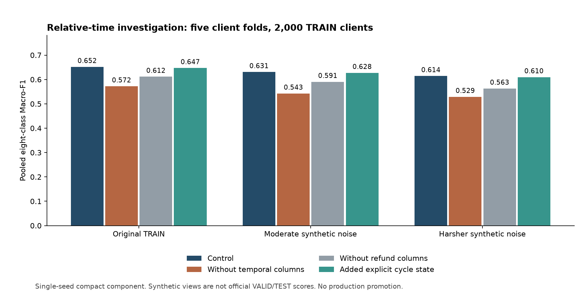
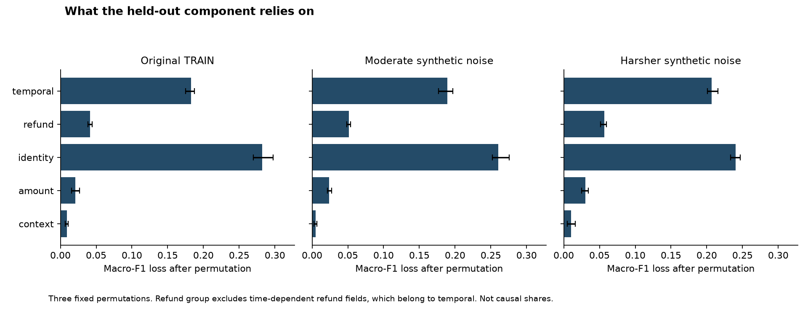

# Investigación: identidad de secuencias y representación del tiempo

## Resultado y alcance

**El modelo ya representa el tiempo relativo y lo relaciona con cada familia.
Los experimentos nuevos confirman que utiliza esa información. Añadir 27
variables explícitas de ciclo no aporta una mejora demostrada.** La siguiente
prioridad razonable es la fidelidad de las secuencias reconstruidas, la
representación de ausencia de evidencia y la asociación de devoluciones.

Se estudió exclusivamente `research/import-v2-stream-identity`, commit
`e4aa4c58175242e198cefd32d6ac4558145523af`. Esta investigación está en
`research/ginestar-stream-time-audit`, creada directamente desde ese commit.
No se incorporó código, métricas, modelos ni resultados de otra rama.

El **0,619493 de Macro-F1 en VALID pertenece al ensemble histórico de la rama
fuente**. No es un resultado nuevo de este estudio ni un score del leaderboard.
Los experimentos nuevos usan cinco particiones de los 2.000 clientes TRAIN y
el componente compacto con una semilla. No sustituyen al ensemble completo,
no acceden a las etiquetas de VALID y no generan una nueva entrega.

**Actualización de la misma rama fuente durante el estudio.** El remoto avanzó
a `d5dddfd8d93df61d3a6421f860428bf491c995f7`. Su README ahora declara el resultado
histórico **INVALID bajo el requisito estricto de no seleccionar usando VALID**.
Esto confirma que 0,619493 debe tratarse como resultado de desarrollo expuesto
a selección, no como holdout independiente. La advertencia se aplica también
al pitch. No hemos intentado corregir esa historia mediante una nueva partición
ni presentar los OOF de este estudio como evaluación independiente del proceso
completo de investigación.

Se contrastó exclusivamente esa actualización de la rama autorizada, sin
estudiar otras ramas ni incorporar sus comparadores. El AST de `streams`,
`compact`, `ranking`, `augmentation` y `templates` permanece igual al excluir
imports y formato. `FamilyForecaster` y `build_features` también conservan su
estructura; los parámetros mantienen sus valores. Otros cambios añaden rutas
de datos, registros, formato y un nuevo benchmark. Se conservó el commit de los
experimentos para no alterar su procedencia. La comparación ejecutable está en
[upstream_update.json](upstream_update.json).

## Qué se ha ejecutado

- Reconstrucción desde los JSONL oficiales, con hashes verificados.
- 16.000 filas candidatas: ocho familias por cada uno de los 2.000 clientes.
- Tres vistas: TRAIN original y las dos corrupciones sintéticas ya definidas
  por la rama fuente. `valid_like` y `test_like` **no son los conjuntos VALID y TEST**.
- Cuatro variantes por cinco folds: 20 ajustes, cada uno con un ranker de
  familias y un clasificador independiente de `none`.
- 60 evaluaciones de folds y 12 resultados agregados de las ocho clases.
- Permutación de cinco grupos de variables, con tres repeticiones por vista;
  intervención adicional que rota el tiempo entre familias del mismo cliente.
- Explicaciones contrastivas de 160 clientes no usados para entrenar su modelo.
- Un reajuste adicional del control para comprobar reproducibilidad local.
- 31 tests pasan. Las comprobaciones de contribuciones, alineación y
  conservación de la puntuación de `none` también se ejecutan dentro del estudio.

El [protocolo](protocol.md) se escribió antes de evaluar nuevos modelos. Las
copias aumentadas de un cliente permanecen en su fold de entrenamiento. Los
perfiles de precios se aprenden de los 10.000 clientes independientes sin
etiquetas, tal como hace la implementación fuente. No se ajustaron parámetros
ni umbrales tras observar los resultados de estas cuatro variantes.

## 1. Interpretación del consejo del experto

La pregunta útil es: **¿qué información necesita el modelo para comparar dos
posibles pagos recurrentes del mismo cliente?**

La implementación ya proporciona, por secuencia y familia:

| Pregunta | Información existente |
|---|---|
| ¿Cuánto tiempo ha pasado? | `last_age`, en días desde el último pago hasta el corte |
| ¿Cada cuánto suele pagarse? | Mediana, media y dispersión de intervalos |
| ¿En qué posición del ciclo estamos? | `overdue_ratio`, aproximadamente edad / intervalo |
| ¿Cuándo tocaría el siguiente según el historial? | `next_median`, `next_recent`, `linear_next` |
| ¿Parece seguir activa? | Recencia, conteos recientes, `active`, `next_active` |
| ¿A qué familia corresponde la evidencia? | Candidatos separados por familia y comparación entre ellos |
| ¿Hay señales de devolución? | Conteos, proporciones y tiempo de devoluciones asociadas |

Pasar de días a segundos no añade información. Restar un corte fijo a una
fecha numérica tampoco crea señal por sí solo. Sí importa conservar la
relación entre identidad, intervalo, recencia, irregularidad y continuidad.

Una fecha proyectada es una inferencia histórica, no una observación futura.
El objetivo evaluado es la familia recurrente, no la precisión de una fecha
exacta. La [revisión del código](representation_review.md) traza qué variables
alcanzan cada experto y qué variables calculadas quedan fuera.

## 2. Comparaciones nuevas con reentrenamiento

Mismos clientes, folds, semillas, hiperparámetros y vistas en las cuatro
variantes. Se mantienen 500 árboles, 15 hojas, learning rate 0,035, semilla 42.
Cada ajuste es el componente compacto con su detector de `none`, sin los
expertos complementarios del 25% ni el promedio de tres semillas de producción.

| Variante | TRAIN original | Ruido moderado | Ruido más intenso |
|---|---:|---:|---:|
| Control, 221 variables | **0,652003** | **0,630846** | **0,614452** |
| Sin columnas temporales | 0,572346 | 0,542751 | 0,529117 |
| Sin columnas de devoluciones | 0,611746 | 0,590637 | 0,563129 |
| Añadir 27 variables explícitas de ciclo | 0,647301 | 0,627606 | 0,609867 |



Se eliminaron 112 columnas temporales, incluyendo comparaciones derivadas,
ventanas recientes y campos temporales de devoluciones. Esto elimina columnas
del clasificador, **no toda influencia previa del tiempo**: la selección de
secuencias ya utiliza recencia. La lista exacta está en
[feature_groups.json](feature_groups.json). La ablación de devoluciones retira
todas las columnas que contienen `refund`, también las temporales. Estas
ablaciones se solapan y sus efectos no se pueden sumar.

En TRAIN original, la diferencia respecto al control y el intervalo del 95%
por bootstrap emparejado de clientes son:

| Cambio | Diferencia de Macro-F1 | Intervalo descriptivo del 95% |
|---|---:|---:|
| Retirar columnas temporales | −0,079657 | [−0,098863; −0,059782] |
| Retirar devoluciones | −0,040257 | [−0,055965; −0,023800] |
| Añadir estado explícito de ciclo | −0,004702 | [−0,013326; +0,004287] |

La pérdida al retirar tiempo o devoluciones también aparece en ambas vistas
con ruido y sus intervalos quedan por debajo de cero. Para las nuevas variables
de ciclo, los tres intervalos incluyen cero: **no hay evidencia de mejora;
tampoco corresponde afirmar un daño estadísticamente establecido**.

Las 27 variables nuevas expresan disponibilidad, ajuste a un ciclo, ciclos
transcurridos, demora, atraso, ciclos posiblemente perdidos y actividad. Incluyen
ciclos semanales y evitan reactivar automáticamente una secuencia antigua por
aritmética modular. Parte de la información duplica `overdue_ratio`, ya existente.
El resultado justifica conservar el control como referencia de este estudio.

Todos los resultados, F1 por clase, matrices de confusión, frecuencias de
predicción, fold scores e intervalos están en [results.csv](results.csv) y
[results.json](results.json). Son estimaciones exploratorias condicionadas a
este protocolo, no garantías de rendimiento futuro.

## 3. ¿Realmente relaciona el tiempo con la familia?

Para cada cliente no visto se rotó el bloque temporal entre sus siete familias
positivas. Se mantuvieron la fila `none`, los campos de identidad y el conjunto
de valores temporales del cliente. Es una intervención artificial que rompe
asociaciones; no representa un futuro plausible del cliente.

| Vista | Control | Tiempo asociado a otra familia | Decisiones que cambian / 2.000 |
|---|---:|---:|---:|
| Original | 0,652003 | 0,504187 | 587 |
| Ruido moderado | 0,630846 | 0,463365 | 638 |
| Ruido más intenso | 0,614452 | 0,419129 | 679 |

En los tres casos, **la máxima variación de la puntuación de `none` fue 0,0**.
Sus agregados simétricos reciben el mismo conjunto de valores. La caída es
evidencia de que el ranker depende de la asociación entre familia y tiempo;
no demuestra que las secuencias reconstruidas sean siempre correctas.

Las permutaciones de bloques completos entre clientes aportan otra perspectiva.
En la vista original, la pérdida media de Macro-F1 fue aproximadamente:

| Grupo permutado | Pérdida media |
|---|---:|
| Identidad, semántica, MCC y plantillas | 0,2821 |
| Variables temporales y sus derivadas | 0,1826 |
| Devoluciones no temporales | 0,0417 |
| Importes, precios y comisiones | 0,0206 |
| Otro contexto | 0,0090 |



Los grupos son dependientes y las permutaciones crean combinaciones que pueden
no aparecer naturalmente. Estas pérdidas **no son porcentajes de causalidad**
ni se suman como una descomposición del score. Los resultados completos de
las tres repeticiones están en [sensitivity.csv](sensitivity.csv).

## 4. Qué explica una predicción concreta

Se calcularon contribuciones nativas de LightGBM para los primeros 32 clientes
retenidos de cada fold: 160 en total, elegidos sin consultar sus etiquetas.
Es una muestra fija para inspección, no una muestra aleatoria representativa
de todos los clientes. Se explica por separado:

1. La diferencia de puntuación bruta entre las dos mejores familias positivas.
2. La puntuación bruta del clasificador de `none`.

Esta distinción es necesaria: el componente sustituye la puntuación `none` del
ranker por la del clasificador independiente. Una contribución grande de
`is_none` en el ranker no explica por sí sola la probabilidad final de `none`.
También pueden existir contribuciones de interacción aunque dos candidatos
tengan el mismo valor de una variable. Una contribución no es una prueba causal.

Las contribuciones contrastivas reconstruyen los márgenes con error máximo
**6,66 × 10⁻¹⁵**. En esta muestra, las mayores contribuciones absolutas medias
al margen entre familias incluyen:

- Proporción de devoluciones del candidato amplio (`broad0_refund_ratio`).
- Posición relativa de su siguiente pago activo (`amount0_next_active_rank`).
- Evidencia semántica y diversidad de descripciones.
- Actividad del candidato en los últimos 60 días.
- Tiempo desde su último pago.

Un ejemplo acertado distingue **insurance frente a gym**. La evidencia sobre
devoluciones y el rango del próximo pago contribuyen a favor de insurance.
Un ejemplo fallado elige **mobile frente a streaming**, cuando la etiqueta
era streaming: la semántica favorecía streaming, pero otras contribuciones
inclinaron el margen final hacia mobile. Esto muestra que la explicación debe
incluir el competidor y las señales en conflicto, no solo una descripción
convincente de la familia elegida.

Ejemplos anonimizados: [margin_examples.json](margin_examples.json) y
[explanation_examples.json](explanation_examples.json). Importancias de muestra:
[margen entre familias](ranker_margin_attribution.csv),
[detector de none](none_attribution.csv) y
[puntuación bruta del ranker](ranker_attribution.csv).
Los identificadores y explicaciones detalladas quedan en outputs ignorados.

Estas explicaciones corresponden al **componente experimental**, no a una
atribución completa de los nueve estimadores del ensemble de producción.

## 5. Problemas de representación: evidencia e importancia

La [auditoría de estados](state_incidence.json) combina datos reales de TRAIN
con contraejemplos sintéticos explícitamente identificados.

**Ausencia mezclada con tiempo.** Hay 1.726 clientes con algún candidato
`amount0` activo. En ellos, la diferencia mediana entre la media calculada con
sentinels y la media solo de candidatos activos es **737,30 días**. El número
no es una predicción de pago a 737 días: evidencia que la media está codificando
ausencia además de tiempo. Un árbol puede aprovechar esa codificación, así
que no se ha demostrado que eliminarla mejore el score. La siguiente prueba
adecuada sería separar explícitamente disponibilidad y demora, reentrenando.

**Ciclos semanales.** Un ejemplo sintético con intervalo de siete días se
redondea a catorce en el bloque compacto. En TRAIN hay solo seis filas
`amount0` y diez `broad0` con intervalo mediano entre seis y ocho días; son
filas candidatas, no necesariamente secuencias distintas y regulares. La
corrección semanal por sí sola tiene poco respaldo como gran mejora.

**Moneda de una devolución.** En un caso sintético de dos pagos simultáneos
en monedas diferentes, cambiar el orden altera la devolución asociada porque
la moneda se infiere del pago temporalmente más cercano. En TRAIN se observaron
**cero empates de timestamp entre pagos con distintas monedas**. Es una
debilidad de robustez, no una explicación demostrada de errores del dataset.

**Pureza y selección de secuencias.** El agrupamiento por proximidad de importe
puede unir suscripciones distintas. Además, se conservan candidatos según
cantidad de observaciones y recencia, no necesariamente por cuál vencería
antes. La etiqueta futura a nivel cliente no proporciona la identidad real
de cada secuencia para resolver esto directamente. Este sigue siendo un
problema de investigación más fundamental que cambiar unidades temporales.

## 6. Qué haría a continuación

1. **Separar disponibilidad y demora.** Comparar la codificación actual de 999
   con flags de ausencia/inactividad, conteo de candidatos y agregados temporales
   calculados solo sobre candidatos disponibles. Mantener constante la selección
   de secuencias para que la comparación sea interpretable.
2. **Conservar la procedencia de cada candidato.** Asociar identidad de secuencia,
   moneda y eventos a la fila de familia. Después contrastar la selección actual
   por recencia/frecuencia con alternativas que retengan candidatos plausibles
   aunque tengan menor volumen. Medir cobertura y resultado final por separado.
3. **Comprobar continuidad con señales coherentes.** Refinar la asociación de
   devoluciones por secuencia e inspeccionar casos en que identidad es ambigua.
   Una devolución es una asociación predictiva; no demuestra cancelación.
4. **Confirmar en el ensemble completo solo una mejora respaldada.** Primero
   repetir un candidato favorable con las semillas fijadas y las mismas vistas.
   Una nueva comprobación en VALID requiere congelar la receta y registrar su
   acceso. No convertir estas pruebas exploratorias en una nueva selección
   repetida sobre VALID.

No promovería `cycle_state` con los resultados actuales. No hay evidencia aquí
de un salto hacia 0,8, de un techo matemático del problema, ni del procedimiento
utilizado por otro equipo.

## 7. Cómo contarlo al jurado

Una afirmación defendible sobre este estudio es:

> "Comprobamos qué necesita realmente el modelo. Al retirar la información
> temporal pierde unos ocho puntos de Macro-F1 en nuestra validación cruzada;
> al asignar ese tiempo a otra familia pierde casi quince. Pero añadir más
> variables de ciclo no mejoró el resultado. Por eso conservamos la versión
> contrastada y centramos la investigación en reconstruir mejor los pagos y
> entender su continuidad. Podemos mostrar qué evidencia distingue dos
> familias y también un caso en el que el modelo se equivoca."

Son diferencias absolutas en la escala 0–1 del **componente evaluado en TRAIN**,
no mejoras del leaderboard. El score histórico de 0,619493 en VALID debe
aparecer identificado por separado. Mostrar una predicción, su competidor,
una decisión técnica descartada y su evidencia es más defendible que afirmar
que añadir detalle temporal hace automáticamente mejor al sistema.

El [documento de evidencia y pitch](evidence_and_pitch.md) contiene una propuesta
de un minuto en inglés y español, preguntas del jurado, experimentos históricos
aceptados/rechazados y límites de las afirmaciones sobre impacto y fechas.
Ese documento y la revisión estática describen primero la rama fuente; los
resultados nuevos se añaden en el presente informe.

## 8. Reproducibilidad y límites

Los paquetes coinciden con `requirements-lock.txt`; esta ejecución utiliza
Python 3.13.2, mientras la reproducción histórica documentaba 3.13.7. El control
nuevo queda cerca, pero **no coincide exactamente** con las métricas históricas
del componente: 0,652003 / 0,630846 / 0,614452 frente a
0,652254 / 0,632888 / 0,610699. No se ha establecido la causa exacta de esas
pequeñas diferencias y no se atribuyen automáticamente a la versión de Python.
Todas las diferencias del estudio utilizan el control nuevo emparejado.

Un reajuste independiente del control del fold 2 produjo probabilidades y
predicciones **idénticas bit a bit** en las tres vistas locales. La recarga de
modelos también conservó las probabilidades. Véase
[local_reproducibility.json](local_reproducibility.json). No equivale a volver
a reproducir el ensemble histórico en VALID.

Los intervalos usan 1.000 remuestreos emparejados de clientes y son descriptivos:
no incluyen todo el proceso previo de selección ni corrigen comparaciones
múltiples. TRAIN ya había sido investigado en la rama fuente. Las corrupciones
son simulaciones. La señal de devoluciones puede ser especialmente fuerte en
este generador sintético y debe validarse antes de extrapolar a banca real.

Comandos desde la raíz de esta rama, con las dependencias instaladas:

```powershell
python scripts/prepare_data.py
python -m pytest -q
python -X utf8 scripts/investigate_stream_time.py --run-name paired_01 --stage all
python -X utf8 scripts/audit_stream_time_states.py --run-name paired_01
python -X utf8 scripts/contrast_stream_time_attribution.py --run-name paired_01
python -X utf8 scripts/plot_stream_time_audit.py
python -X utf8 scripts/recheck_stream_time_control.py
```

El runner reanuda folds completos solo si coinciden hashes de código, datos,
protocolo, modelos y predicciones. Ante cambios de código se debe utilizar un
nombre de ejecución nuevo. Los gráficos leen los informes agregados de la
última ejecución resumida. El script de reajuste comprueba deliberadamente
`paired_01`, fold 2. Modelos, matrices, datos y predicciones detalladas quedan
en `outputs/stream_time_audit/paired_01/`, ignorado por Git.

La [procedencia](provenance.json) registra el commit fuente, hashes, versiones,
semillas y hora de inicio. El código de producción, la submission congelada,
el historial de accesos a VALID y el registro histórico de experimentos se
mantienen intactos.

La [verificación independiente](verification.json) reconstruye las doce
métricas y matrices de confusión desde los CSV de predicciones, comprueba las
probabilidades y verifica que ninguno de los veinte modelos entrenó con sus
clientes retenidos. La discrepancia máxima de Macro-F1 es cero. Se reproduce
con `python scripts/verify_stream_time_results.py` para `paired_01`.


## 9. Cierre de la entrega

La revisi?n final vuelve a ejecutar los 31 tests (todos pasan) y reconstruye
los 12 resultados desde las predicciones guardadas: discrepancia m?xima de
Macro-F1 cero, matrices de confusi?n coincidentes y probabilidades normalizadas.
Los 20 modelos conservan la separaci?n entre sus clientes de ajuste y evaluaci?n.
Todos los hashes del c?digo experimental registrado en `provenance.json`
coinciden con los archivos entregados. No se han reentrenado modelos ni consultado
etiquetas de VALID/TEST durante este cierre.

Los cinco scripts auxiliares pendientes de entrega pasan Ruff y su comprobaci?n
de formato. Los ajustes son de formato y documentaci?n de imports posteriores a
la incorporaci?n de `src` al path; se verific? que sus AST de Python no cambian.
El c?digo de producci?n, el runner experimental congelado y sus hashes permanecen
intactos.

Las comprobaciones globales de Ruff **no pasan**: quedan 456 incidencias de lint
y 47 archivos por formatear, todos fuera de esos cinco scripts y sin modificar
en este cierre. Se documentan en lugar de reformatear la implementaci?n congelada.
Esta rama no contiene una configuraci?n de pre-commit ni un quality gate adicional.
`git diff --check` pasa. Estos l?mites de estilo no deben confundirse con el
resultado de los tests o de la reconciliaci?n num?rica.
