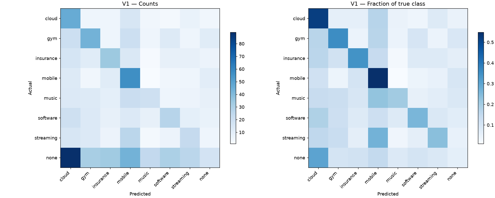

# V1 Final Report

## 1. Executive summary

| metric | V1 | V2 | delta |
| --- | --- | --- | --- |
| macro_f1 | 0.271024 | 0.391549 | 0.120525 |
| accuracy | 0.266000 | 0.424000 | 0.158000 |

V1 es un control reproducible e interpretable con buen recall relativo en algunas familias,
pero falla especialmente en none. La codificación supervisada in-sample afecta a los candidatos ML;
no invalida automáticamente la inferencia del heurístico sobre clientes valid excluidos del fit.
V2 gana globalmente en este valid reutilizado. Music retrocede; streaming apenas mejora en F1.
El informe de integración contiene ablations: history CatBoost .383950488 y blend .391549456;
el pequeño delta de mezcla .007598968 no prueba por sí solo generalización. No se reejecutaron esas
ablations en este encargo. La comparación final no identifica causalmente cuánto aporta cada cambio.


## 2. Scope and evidence sources

V1: `0199a8b7c8b2c790a9d3447b156f2088708c2864`; V2: `96409b7940a991fbda5235b85ffeb40652a4087b`. El informe V2 remoto identifica explícitamente
0199a8b como baseline y describe 0.391549456 para la mezcla final. Ambas versiones se ejecutaron
desde worktrees detached del commit exacto. Los informes históricos orientaron la identificación;
las métricas de este informe se recalcularon de las predicciones frescas y etiquetas oficiales.

Inventario de CSV locales:

| path | kind | sha256 | schema_validation |
| --- | --- | --- | --- |
| data/raw/ubs_2026/sample_submission.csv | C: template, not truth | 53a24cd23d680c2573f5b048dd69d1747f20adc45e308593d914ee13e8d00ed2 | NOT A TEST SUBMISSION |
| outputs/metrics/v1_benchmark/v1/submission.csv | B: test predictions; labels unavailable | b67d364e207d297b1a4d5898f0c37b6f62289cf56808882f5bdcfeb6c5795b0f | PASS |
| outputs/metrics/v1_benchmark/v2/submission.csv | B: test predictions; labels unavailable | da1314cfdea23ffea7756ff82db4e7d4efe77c6fcaf33cb0b66a689795f59adc | PASS |
| outputs/metrics/v1_benchmark/v2/validation_predictions.csv | A: validation predictions | 57ca783d554b9aea6602f1046582dc18c93ddfe5d418ba50173ab1e36cb9313a | NOT A TEST SUBMISSION |
| outputs/predictions/milestone1_carles.csv | B: test predictions; labels unavailable | 17d0ecc6667b8e0e6f54fa345366cfef083d106de769961dcb7e2fc2695ce3f7 | PASS |
| outputs/predictions/submission_carles_entrega_v1.csv | B: test predictions; labels unavailable | b67d364e207d297b1a4d5898f0c37b6f62289cf56808882f5bdcfeb6c5795b0f | PASS |
| outputs/predictions/submission_v1_audit_20260924.csv | B: test predictions; labels unavailable | eb0c47b1b406e441dde0183f65737fdf8e24dd47bc97d4c18c9522a00789e1c5 | PASS |
| outputs/predictions/submission_v1_m2_internal_20260924.csv | B: test predictions; labels unavailable | 994ef9b3838dc36514346ee9367bc1e6d54f80db70e060337ab9ccc1cbf4ee7f | PASS |
| outputs/predictions/temporal_v2_v1_reproduction.csv | B: test predictions; labels unavailable | b67d364e207d297b1a4d5898f0c37b6f62289cf56808882f5bdcfeb6c5795b0f | PASS |

## 3. Exact baseline identification

V1 `0199a8b7c8b2c790a9d3447b156f2088708c2864`. Config `configs/ubs_v1.toml`, seed=42. Ganador `recurrence_heuristic`. El código histórico se conserva sin cambios.

## 4. Dataset and prediction target

Split oficial: 2.000 clientes train, 1.000 valid, 1.000 test; cutoff UTC 2026-01-01;
horizonte objetivo 90 días. Macro-F1 es media simple de ocho F1, F1_c=2TP/(2TP+FP+FN),
zero_division=0. Alineación por client_id comprobada, no por posición accidental.
V1 seleccionó configuración en valid. V2 también fue seleccionada mediante experimentos sobre ese
valid. Comparación descriptiva justa en el mismo conjunto; no evaluación independiente ni estimación
garantizada del leaderboard. El CSV de test carece de etiquetas y no permite calcular accuracy/F1.


| split | transactions | clients | at_or_after_cutoff | exact_duplicates | repeated_client_timestamp_rows |
| --- | --- | --- | --- | --- | --- |
| train | 147459 | 2000 | 0 | 0 | 0 |
| valid | 73898 | 1000 | 0 | 0 | 0 |
| test | 75761 | 1000 | 0 | 0 | 0 |

Contrato: docs/OFFICIAL_CHALLENGE.md; fuente UBS fijada allí a commit 796d5805ec5f8a228a3ec0de36a2b4e6e1b1a1df. No hay merchant-family por evento.

## 5. Data processing

JSONL: client_id, timestamp, amount, currency, description, direction, fee, mcc, type. Fechas UTC; texto lower/strip; MCC string; orden estable cliente/timestamp. El loader rechaza timestamps >= cutoff, duplicados exactos y solapamiento entre splits. Las etiquetas contienen cutoff_date y target. No hay conversión FX.

| split | transactions | clients | at_or_after_cutoff | exact_duplicates | repeated_client_timestamp_rows |
| --- | --- | --- | --- | --- | --- |
| train | 147459 | 2000 | 0 | 0 | 0 |
| valid | 73898 | 1000 | 0 | 0 | 0 |
| test | 75761 | 1000 | 0 | 0 | 0 |

## 6. Architecture

`ubs.data.load_ubs_data` carga train/valid/test y sus contratos. `ClientFeatureBuilder.fit`
aprende vocabularios y asociación supervisada descripción-familia con train. `transform` agrega cada split
a una fila por cliente; el ID es índice de alineación, no una feature numérica. Se comparan dummy,
heurístico, seis regresiones logísticas, dos CatBoost y un ensemble seleccionado. Se elige el máximo
Macro-F1 (accuracy desempata) sobre valid. Finalmente se reconstruye el builder sobre 3.000 clientes
train+valid y se aplica la receta seleccionada a los 1.000 test. Las métricas proceden de antes del refit.
No se usa el archivo opcional de preentrenamiento sin etiquetas.

Fuentes: `scripts/run_ubs_baseline.py`, `src/transaction_forecasting/ubs/{data,features,models,evaluation}.py`.


## 7. Features

El builder produce **218 columnas** en esta ejecución. El ganador heurístico utiliza solo
cuatro por familia (32 entradas); no utiliza directamente todas las 218 columnas ni TF-IDF.

| Bloque | Definición / información | Ausentes y limitaciones |
| --- | --- | --- |
| Volumen/dirección | n_transactions, n_out, n_in, out_share=n_out/n | Una fila por cliente observado; sin manejo de clientes sin movimientos |
| Importes y fees | sum/mean/median/std/min/max de amount; suma/media/ratio positivo de fee | Agregados generales mezclan monedas nominales; no son importes convertidos |
| Diversidad | número de MCC, descripciones, tipos, monedas | Identidad por descripción normalizada, no merchant real |
| Historia | history_days=max(t)-min(t); recencia=cutoff-max(t); transacciones/30 días | Duración se limita a 1 día para evitar división por cero |
| Ventanas | counts, outgoing y counts/window en 7/14/30/60/90/180 días | Ventanas fijadas en features.py; recent_windows de TOML no gobierna ese código |
| Calendario | shares por día/fin de semana; meses activos; media/std/CV mensual | Estadística mensual incluye meses con actividad, no todos los meses vacíos |
| Gaps | media/mediana/std entre eventos consecutivos por cliente | Mezcla comercios; timestamps repetidos generan gaps cero |
| Categorías | count/share por MCC, tipo, moneda y dirección | Vocabulario ajustado en train; categorías nuevas no generan columnas nuevas |
| Moneda | suma/media/mediana/std de amount por moneda | Convive con agregados generales sin convertir |
| Streams | grupos cliente+descripción con al menos dos eventos | Mezcla monedas/tipos bajo descripción; no deduplica timestamps para intervalos |
| Recurrencia | counts repetidos, regularidad, estabilidad de importe, score máximo/medio | Dos observaciones dan un intervalo con std poblacional cero: evidencia de regularidad débil |
| Periodicidad | número de streams en [4,10), [10,18), [18,45), [45,110), [110,400) días | Etiqueta annual abarca 110–400 días: no demuestra periodicidad anual |
| Familia | 9 columnas x 8 familias = 72: occurrences, descriptions, recency, frequency, regularity, typical_amount, amount_similarity, description_lift, recurrence_score | Asociación supervisada; filas train se codifican usando su propia etiqueta en los candidatos ML |
| Texto (candidatos LR) | TF-IDF word unigram/bigram, min_df=2, max_df=.98, sublinear_tf, hasta 2500 términos | Ajustado solo en train; no es parte del ganador heurístico |

En presencia de streams, el builder rellena NaN con cero. Inf se convierte a NaN al final.
Si no hay streams globalmente, no crea todas las columnas familiares: edge case de esquema.
El inventario exacto está en `v1_benchmark_evidence.json` y al final de este apartado.

**Ecuaciones.** Para stream s: d=mediana de intervalos, r=cutoff-último evento,
CV_t=std(intervalos)/max(d,1), R=1/(1+CV_t),
D=exp(-abs(r-d)/max(d,7)), CV_a=std(amount)/max(mean(amount),1e-9),
B=log(1+n)*R*D/(1+CV_a). El score no calcula explícitamente una probabilidad de evento en 90 días.

Para descripción u y clase c: lift=clip(log(((n_uc+1)/(N_c+2))/((n_u_notc+1)/(N_notc+2))),0,log(10)).
Se conserva solo la clase con lift máximo si lift>=log(1.5) y support>=2 clientes.
Por cliente/familia, recurrence_score suma B*lift; occurrences suma apariciones,
regularity y description_lift son máximos de streams con evidencia.

Logit de familia c = log(1+recurrence_score_c) + .15 log(1+occurrences_c)
+ .20 description_lift_c + .10 regularity_c. A none se añade bias; softmax(logit/T)
produce los valores usados en selección. No son probabilidades calibradas demostradas.

Inventario completo: `n_transactions`, `n_out`, `n_in`, `out_share`, `amount_sum`, `amount_mean`, `amount_median`, `amount_std`, `amount_min`, `amount_max`, `fee_sum`, `fee_mean`, `fee_positive_share`, `n_unique_mcc`, `n_unique_description`, `n_unique_type`, `n_unique_currency`, `history_days`, `days_since_last_transaction`, `transactions_per_30d`, `transactions_last_7d`, `outgoing_last_7d`, `frequency_last_7d`, `transactions_last_14d`, `outgoing_last_14d`, `frequency_last_14d`, `transactions_last_30d`, `outgoing_last_30d`, `frequency_last_30d`, `transactions_last_60d`, `outgoing_last_60d`, `frequency_last_60d`, `transactions_last_90d`, `outgoing_last_90d`, `frequency_last_90d`, `transactions_last_180d`, `outgoing_last_180d`, `frequency_last_180d`, `weekend_share`, `dow_0_share`, `dow_1_share`, `dow_2_share`, `dow_3_share`, `dow_4_share`, `dow_5_share`, `dow_6_share`, `active_months`, `monthly_count_mean`, `monthly_count_std`, `monthly_count_cv`, `event_gap_mean`, `event_gap_median`, `event_gap_std`, `mcc_4111_count`, `mcc_4111_share`, `mcc_4814_count`, `mcc_4814_share`, `mcc_5411_count`, `mcc_5411_share`, `mcc_5732_count`, `mcc_5732_share`, `mcc_5734_count`, `mcc_5734_share`, `mcc_5812_count`, `mcc_5812_share`, `mcc_5912_count`, `mcc_5912_share`, `mcc_6011_count`, `mcc_6011_share`, `mcc_6012_count`, `mcc_6012_share`, `mcc_6300_count`, `mcc_6300_share`, `mcc_7011_count`, `mcc_7011_share`, `mcc_7997_count`, `mcc_7997_share`, `type_atm_count`, `type_atm_share`, `type_card_payment_count`, `type_card_payment_share`, `type_fee_count`, `type_fee_share`, `type_p2p_transfer_count`, `type_p2p_transfer_share`, `type_refund_count`, `type_refund_share`, `type_topup_count`, `type_topup_share`, `type_transfer_count`, `type_transfer_share`, `currency_chf_count`, `currency_chf_share`, `currency_eur_count`, `currency_eur_share`, `currency_gbp_count`, `currency_gbp_share`, `currency_usd_count`, `currency_usd_share`, `direction_in_count`, `direction_in_share`, `direction_out_count`, `direction_out_share`, `amount_chf_sum`, `amount_chf_mean`, `amount_chf_median`, `amount_chf_std`, `amount_eur_sum`, `amount_eur_mean`, `amount_eur_median`, `amount_eur_std`, `amount_gbp_sum`, `amount_gbp_mean`, `amount_gbp_median`, `amount_gbp_std`, `amount_usd_sum`, `amount_usd_mean`, `amount_usd_median`, `amount_usd_std`, `repeated_description_count`, `repeated_transaction_count`, `max_description_appearances`, `mean_description_appearances`, `regular_stream_count`, `stable_amount_stream_count`, `best_recurrence_score`, `mean_recurrence_score`, `stream_median_interval_days_mean`, `stream_median_interval_days_min`, `stream_interval_std_days_mean`, `stream_interval_std_days_min`, `stream_interval_cv_mean`, `stream_interval_cv_min`, `stream_days_since_last_mean`, `stream_days_since_last_min`, `stream_amount_cv_mean`, `stream_amount_cv_min`, `stream_regularity_mean`, `stream_regularity_min`, `stream_due_score_mean`, `stream_due_score_min`, `periodicity_weekly_count`, `periodicity_biweekly_count`, `periodicity_monthly_count`, `periodicity_quarterly_count`, `periodicity_annual_count`, `family_cloud_occurrences`, `family_cloud_descriptions`, `family_cloud_recency`, `family_cloud_frequency`, `family_cloud_regularity`, `family_cloud_typical_amount`, `family_cloud_amount_similarity`, `family_cloud_description_lift`, `family_cloud_recurrence_score`, `family_gym_occurrences`, `family_gym_descriptions`, `family_gym_recency`, `family_gym_frequency`, `family_gym_regularity`, `family_gym_typical_amount`, `family_gym_amount_similarity`, `family_gym_description_lift`, `family_gym_recurrence_score`, `family_insurance_occurrences`, `family_insurance_descriptions`, `family_insurance_recency`, `family_insurance_frequency`, `family_insurance_regularity`, `family_insurance_typical_amount`, `family_insurance_amount_similarity`, `family_insurance_description_lift`, `family_insurance_recurrence_score`, `family_mobile_occurrences`, `family_mobile_descriptions`, `family_mobile_recency`, `family_mobile_frequency`, `family_mobile_regularity`, `family_mobile_typical_amount`, `family_mobile_amount_similarity`, `family_mobile_description_lift`, `family_mobile_recurrence_score`, `family_music_occurrences`, `family_music_descriptions`, `family_music_recency`, `family_music_frequency`, `family_music_regularity`, `family_music_typical_amount`, `family_music_amount_similarity`, `family_music_description_lift`, `family_music_recurrence_score`, `family_software_occurrences`, `family_software_descriptions`, `family_software_recency`, `family_software_frequency`, `family_software_regularity`, `family_software_typical_amount`, `family_software_amount_similarity`, `family_software_description_lift`, `family_software_recurrence_score`, `family_streaming_occurrences`, `family_streaming_descriptions`, `family_streaming_recency`, `family_streaming_frequency`, `family_streaming_regularity`, `family_streaming_typical_amount`, `family_streaming_amount_similarity`, `family_streaming_description_lift`, `family_streaming_recurrence_score`, `family_none_occurrences`, `family_none_descriptions`, `family_none_recency`, `family_none_frequency`, `family_none_regularity`, `family_none_typical_amount`, `family_none_amount_similarity`, `family_none_description_lift`, `family_none_recurrence_score`

## 8. Models and heuristics

La reproducción ejecuta el procedimiento histórico, sin ampliar su búsqueda:
dummy mayoritario; 95 combinaciones del heurístico (19 biases -2..2.5 por .25 y 5 temperaturas);
6 LR (C=.3,1,3 x pesos none/balanced); 2 CatBoost (350 iteraciones, profundidad 6,
learning_rate=.05, seed=42, pesos normal/balanced); 10 mezclas del mejor ML con heurístico
(alpha=.05.. .50). Se registra el mejor ensemble como una fila, no todos los alpha.
La temperatura positiva no cambia el argmax del heurístico aislado; sí sus probabilidades en mezclas.
Desempate heurístico favorece bias cercano a cero y temperatura cercana a 1.
El ganador es recurrence_heuristic con none_bias=-1 y temperature=1.
Un bias negativo reduce none; no aumenta su sensibilidad.

Resultados históricos reproducidos de candidatos:

| model | feature_set | class_weight | macro_f1 | accuracy | train_seconds | inference_seconds | feature_count | validation_clients | notes |
| --- | --- | --- | --- | --- | --- | --- | --- | --- | --- |
| recurrence_heuristic | train-learned description lift + recurrence streams | validation-calibrated none bias | 0.271024 | 0.266000 | 0.796045 | 0.000808 | 32 | 1000 | none_bias=-1.00; temperature=1.00 |
| ensemble_logistic_c0.3_balanced_heuristic | best ML probabilities + heuristic probabilities | inherited | 0.214015 | 0.281000 | 0.301526 | 0.000133 | 2538 | 1000 | alpha=0.50; delta_macro_f1=+0.013970 |
| logistic_c0.3_balanced | client aggregates + train-only word/bigram TF-IDF | balanced | 0.200045 | 0.280000 | 5.311257 | 0.320062 | 2538 | 1000 | C=0.3 |
| catboost_balanced | numeric client and recurrence aggregates | balanced | 0.191674 | 0.295000 | 81.265350 | 0.064821 | 218 | 1000 | iterations=350; depth=6 |
| logistic_c1_balanced | client aggregates + train-only word/bigram TF-IDF | balanced | 0.185825 | 0.279000 | 5.411020 | 0.225341 | 2538 | 1000 | C=1 |
| logistic_c3_balanced | client aggregates + train-only word/bigram TF-IDF | balanced | 0.180328 | 0.293000 | 6.878845 | 0.229756 | 2538 | 1000 | C=3 |
| logistic_c0.3_none | client aggregates + train-only word/bigram TF-IDF | none | 0.176623 | 0.290000 | 3.327041 | 0.230361 | 2538 | 1000 | C=0.3 |
| logistic_c1_none | client aggregates + train-only word/bigram TF-IDF | none | 0.163490 | 0.293000 | 4.515336 | 0.214463 | 2538 | 1000 | C=1 |
| logistic_c3_none | client aggregates + train-only word/bigram TF-IDF | none | 0.155181 | 0.296000 | 10.645674 | 0.430197 | 2538 | 1000 | C=3 |
| catboost_normal | numeric client and recurrence aggregates | none | 0.153576 | 0.313000 | 76.834027 | 0.055212 | 218 | 1000 | iterations=350; depth=6 |
| dummy_majority | none | none | 0.056651 | 0.293000 | 0.000343 | 0.000076 | 0 | 1000 | Always predicts train majority: none |

## 9. Configuration selection

El score comunicado es el máximo seleccionado sobre valid, no un test independiente. No se cambió la búsqueda histórica. La misma configuración se conserva en refit train+valid.

V1 runner completo: 237.35 s. V2 fit+refit: 227.12 s. Son costes end-to-end de trabajos diferentes: V1 incluye selección completa y V2 receta congelada.
Se ejecutaron concurrentemente, por lo que estos tiempos no constituyen un benchmark aislado de latencia.
Los tiempos por candidato V1 se incluyen en la tabla de experimentos.


## 10. Validation protocol

Split oficial: 2.000 clientes train, 1.000 valid, 1.000 test; cutoff UTC 2026-01-01;
horizonte objetivo 90 días. Macro-F1 es media simple de ocho F1, F1_c=2TP/(2TP+FP+FN),
zero_division=0. Alineación por client_id comprobada, no por posición accidental.
V1 seleccionó configuración en valid. V2 también fue seleccionada mediante experimentos sobre ese
valid. Comparación descriptiva justa en el mismo conjunto; no evaluación independiente ni estimación
garantizada del leaderboard. El CSV de test carece de etiquetas y no permite calcular accuracy/F1.


## 11. Reproduced metrics

| metric | V1 | V2 | delta |
| --- | --- | --- | --- |
| macro_f1 | 0.271024 | 0.391549 | 0.120525 |
| accuracy | 0.266000 | 0.424000 | 0.158000 |

## 12. F1 per class

| class | support | V1 predicted | V2 predicted | V1 precision | V2 precision | delta precision | V1 recall | V2 recall | delta recall | V1 F1 | V2 F1 | delta F1 | corrected | introduced |
| --- | --- | --- | --- | --- | --- | --- | --- | --- | --- | --- | --- | --- | --- | --- |
| cloud | 89 | 230 | 71 | 0.200000 | 0.507042 | 0.307042 | 0.516854 | 0.404494 | -0.112360 | 0.288401 | 0.450000 | 0.161599 | 11 | 21 |
| gym | 121 | 132 | 154 | 0.325758 | 0.435065 | 0.109307 | 0.355372 | 0.553719 | 0.198347 | 0.339921 | 0.487273 | 0.147352 | 28 | 4 |
| insurance | 99 | 111 | 148 | 0.306306 | 0.358108 | 0.051802 | 0.343434 | 0.535354 | 0.191919 | 0.323810 | 0.429150 | 0.105340 | 24 | 5 |
| mobile | 104 | 209 | 139 | 0.272727 | 0.395683 | 0.122956 | 0.548077 | 0.528846 | -0.019231 | 0.364217 | 0.452675 | 0.088458 | 11 | 13 |
| music | 93 | 66 | 60 | 0.287879 | 0.216667 | -0.071212 | 0.204301 | 0.139785 | -0.064516 | 0.238994 | 0.169935 | -0.069059 | 9 | 15 |
| software | 104 | 95 | 142 | 0.284211 | 0.323944 | 0.039733 | 0.259615 | 0.442308 | 0.182692 | 0.271357 | 0.373984 | 0.102627 | 24 | 5 |
| streaming | 97 | 89 | 63 | 0.258427 | 0.317460 | 0.059033 | 0.237113 | 0.206186 | -0.030928 | 0.247312 | 0.250000 | 0.002688 | 12 | 15 |
| none | 293 | 68 | 223 | 0.250000 | 0.600897 | 0.350897 | 0.058020 | 0.457338 | 0.399317 | 0.094183 | 0.519380 | 0.425197 | 127 | 10 |

## 13. Confusion matrix

### V1

| actual / predicted | cloud | gym | insurance | mobile | music | software | streaming | none |
| --- | --- | --- | --- | --- | --- | --- | --- | --- |
| cloud | 46 | 5 | 5 | 15 | 4 | 3 | 7 | 4 |
| gym | 20 | 43 | 5 | 20 | 5 | 12 | 5 | 11 |
| insurance | 16 | 11 | 34 | 14 | 2 | 8 | 8 | 6 |
| mobile | 12 | 4 | 11 | 57 | 1 | 4 | 5 | 10 |
| music | 13 | 12 | 9 | 21 | 19 | 5 | 6 | 8 |
| software | 19 | 13 | 8 | 13 | 8 | 27 | 9 | 7 |
| streaming | 15 | 13 | 6 | 26 | 3 | 6 | 23 | 5 |
| none | 89 | 31 | 33 | 43 | 24 | 30 | 26 | 17 |

### V2

| actual / predicted | cloud | gym | insurance | mobile | music | software | streaming | none |
| --- | --- | --- | --- | --- | --- | --- | --- | --- |
| cloud | 36 | 5 | 11 | 6 | 4 | 10 | 5 | 12 |
| gym | 7 | 67 | 9 | 9 | 5 | 7 | 5 | 12 |
| insurance | 4 | 6 | 53 | 4 | 2 | 7 | 7 | 16 |
| mobile | 0 | 7 | 15 | 55 | 3 | 8 | 0 | 16 |
| music | 3 | 14 | 16 | 12 | 13 | 12 | 11 | 12 |
| software | 5 | 12 | 10 | 12 | 2 | 46 | 4 | 13 |
| streaming | 2 | 17 | 10 | 10 | 17 | 13 | 20 | 8 |
| none | 14 | 26 | 24 | 31 | 14 | 39 | 11 | 134 |



## 14. Error profile

| actual | predicted | errors | share_of_class_errors |
| --- | --- | --- | --- |
| none | cloud | 89 | 0.322464 |
| none | mobile | 43 | 0.155797 |
| none | insurance | 33 | 0.119565 |
| none | gym | 31 | 0.112319 |
| none | software | 30 | 0.108696 |
| streaming | mobile | 26 | 0.351351 |
| none | streaming | 26 | 0.094203 |
| none | music | 24 | 0.086957 |
| music | mobile | 21 | 0.283784 |
| gym | cloud | 20 | 0.256410 |
| gym | mobile | 20 | 0.256410 |
| software | cloud | 19 | 0.246753 |

Medianas V1 correcto/incorrecto (descriptivas, no causales):

| correct | n_transactions | history_days | days_since_last_transaction | repeated_description_count | stream_interval_cv_mean | best_recurrence_score |
| --- | --- | --- | --- | --- | --- | --- |
| False | 72.000000 | 408.082043 | 3.269311 | 16.000000 | 0.493856 | 0.804885 |
| True | 73.000000 | 409.079363 | 3.204780 | 17.000000 | 0.503854 | 0.824422 |

Por clase:

| actual | correct | n_transactions | history_days | days_since_last_transaction | repeated_description_count | stream_interval_cv_mean | best_recurrence_score |
| --- | --- | --- | --- | --- | --- | --- | --- |
| cloud | False | 84.000000 | 409.575046 | 2.213762 | 18.000000 | 0.482035 | 0.807081 |
| cloud | True | 69.500000 | 407.203426 | 3.147361 | 16.000000 | 0.399300 | 0.835242 |
| gym | False | 75.500000 | 410.315654 | 3.196985 | 16.000000 | 0.491365 | 0.826837 |
| gym | True | 66.000000 | 409.006759 | 3.099329 | 16.000000 | 0.492328 | 0.796569 |
| insurance | False | 66.000000 | 405.774884 | 2.678808 | 16.000000 | 0.512850 | 0.781626 |
| insurance | True | 76.500000 | 409.439433 | 2.622384 | 17.000000 | 0.542329 | 0.866701 |
| mobile | False | 77.000000 | 409.353785 | 2.691968 | 17.000000 | 0.591578 | 0.831482 |
| mobile | True | 79.000000 | 411.679352 | 3.342951 | 18.000000 | 0.554311 | 0.850012 |
| music | False | 80.500000 | 407.083125 | 3.237975 | 18.000000 | 0.501117 | 0.857245 |
| music | True | 73.000000 | 410.928495 | 3.207708 | 16.000000 | 0.440174 | 0.677352 |
| none | False | 65.000000 | 407.121262 | 3.698854 | 16.000000 | 0.484970 | 0.777510 |
| none | True | 68.000000 | 412.274074 | 1.471863 | 15.000000 | 0.638586 | 0.751412 |
| software | False | 80.000000 | 407.822662 | 3.349734 | 19.000000 | 0.494210 | 0.824462 |
| software | True | 74.000000 | 405.617500 | 3.564745 | 18.000000 | 0.467820 | 0.817817 |
| streaming | False | 71.500000 | 411.347257 | 3.371881 | 16.000000 | 0.496513 | 0.788737 |
| streaming | True | 76.000000 | 406.590440 | 5.644433 | 18.000000 | 0.541275 | 0.800670 |

## 15. None analysis

| class | support | V1 predicted | V2 predicted | V1 precision | V2 precision | delta precision | V1 recall | V2 recall | delta recall | V1 F1 | V2 F1 | delta F1 | corrected | introduced |
| --- | --- | --- | --- | --- | --- | --- | --- | --- | --- | --- | --- | --- | --- | --- |
| none | 293 | 68 | 223 | 0.250000 | 0.600897 | 0.350897 | 0.058020 | 0.457338 | 0.399317 | 0.094183 | 0.519380 | 0.425197 | 127 | 10 |

| positive_to_none | none_to_positive | true_none_corrected | true_none_regressed |
| --- | --- | --- | --- |
| 206 | 51 | 127 | 10 |

none es una clase real, no abstención. V1 la penaliza con bias=-1 pese a ser la más frecuente.

## 16. Leakage audit

| Severidad | Evidencia / ubicación | Consecuencia | Estado y recomendación |
| --- | --- | --- | --- |
| Alta | models.RecurrenceHeuristic.tune recibe x_valid/y_valid; runner selecciona modelos/alpha sobre valid | Métrica de selección optimista; no es prueba independiente | Histórico preservado. Reservar un test nuevo o evaluación interna separada |
| Alta | ClientFeatureBuilder.fit usa etiquetas train; transform(train) reutiliza el mismo mapa | Candidatos LR/CatBoost reciben codificación influida por su propia etiqueta | No atribuir este mecanismo a filtración de etiquetas valid en el ganador heurístico; V2 elimina 72 columnas del ML |
| Media | data.py exige timestamps < cutoff e IDs disjuntos; ver tabla de controles | Reduce filtración temporal y entre clientes | Controles ejecutados; no prueba absoluta de ausencia de leakage |
| Media | Importes generales y streams mezclan monedas nominales | Scores de estabilidad no equivalen a magnitudes monetarias comparables | No corregido en reproducción; ya existen momentos por moneda |
| Media | features._add_recurrence_features retorna antes si streams.empty | Esquema incompleto en datos sin recurrencias; posible KeyError heurístico | No ocurre en datos oficiales de esta ejecución; agregar fallback en futuro |
| Media | Intervalos no deduplicados; dos eventos dan std=0 | Regularidad aparente con evidencia escasa | Riesgo de robustez, no prueba de leakage |
| Baja | cutoff/target/recent_windows declarados en config pero definidos por constantes del código | Config puede aparentar flexibilidad que no tiene | Documentar las constantes efectivas |
| Control | Vocabulario, imputer, scaler, TF-IDF ajustados con train; IDs solo índice | No se observó fit de estos componentes con valid/test | Inspección de código, no auditoría de todo futuro cambio |
| Control | Refit train+valid separado del scoring | Etiquetas valid autorizadas para modelo final test | Nunca puntuar refit sobre valid como holdout |

No se modificó el predictor para maquillar o corregir V1. No hay test oculto etiquetado local.
No se fabricaron targets históricos: la etiqueta por cliente de enero no etiqueta cada transacción.


## 17. Reproducibility

Python y librerías:

```json
{
  "numpy": "2.3.5",
  "pandas": "2.3.3",
  "scikit-learn": "1.9.1",
  "catboost": "1.2.10",
  "matplotlib": "3.11.2",
  "python": "3.12.10"
}
```

Commits y hashes de entradas/submissions están en `v1_benchmark_evidence.json`.
El V2 remoto reporta otro runtime Python; por eso se comparan hashes además de métricas.
Se usa PYTHONPATH del worktree correspondiente para impedir importar accidentalmente otro predictor.


## 18. Tests

V1/base: 37 tests pasaron en esta sesión. Primer intento: 34 pases y 3 errores de permisos
en el directorio temporal de Windows; repetición con acceso autorizado: 37 pases, un warning de caché.
Los 28 tests citados por el equipo son una cifra histórica, no el total del commit reproducido.
Resultados de V2, lint y pre-commit de esta auditoría se registran en `v1_benchmark_checks.md`.


## 19. Submission validation

| version | rows | unique_ids | status | sha256 |
| --- | --- | --- | --- | --- |
| v1 | 1000 | 1000 | PASS | b67d364e207d297b1a4d5898f0c37b6f62289cf56808882f5bdcfeb6c5795b0f |
| v2 | 1000 | 1000 | PASS | da1314cfdea23ffea7756ff82db4e7d4efe77c6fcaf33cb0b66a689795f59adc |

Test: 380 predicciones coinciden; 620 difieren. No se conoce cuál acierta.

Se validaron columnas exactas, IDs únicos, cobertura, orden sample, ausencia de nulos y vocabulario.
Submissions reproducidas: `outputs/metrics/v1_benchmark/v1/submission.csv` y `v2/submission.csv`.
No son prueba de que el CSV enviado al dashboard sea el mismo: no se recibió un adjunto CSV en esta tarea.
El informe remoto declara SHA V1 b67d364e207d297b1a4d5898f0c37b6f62289cf56808882f5bdcfeb6c5795b0f
y V2 da1314cfdea23ffea7756ff82db4e7d4efe77c6fcaf33cb0b66a689795f59adc; cotejar con tabla.


## 20. Strengths

Control transparente, esquema estricto, ocho clases fijas, vocabulario aprendido en train, refit separado y ejecución reproducible. V1 constituye un fallback verificable.

## 21. Weaknesses

Selección sobre valid; none infrapredicha; candidatos ML con target encoding in-sample; mezcla nominal de monedas; regularidad débil con pocos eventos; sin incertidumbre independiente. Ver auditoría para alcance exacto.

## 22. What V2 changes

V2 fija CatBoost balanceado (300 iteraciones, profundidad 4, learning_rate=.05,
seed=42, cuatro threads) sobre **146 features de historia sin etiquetas**. Excluye las 72 family_*.
Combina .75 probabilidades CatBoost + .25 heurístico de periodicidad, bias=-1/T=1.
El mapa supervisado separado solo se usa para inferencia en clientes excluidos de fit.
`IntegratedV2Model.predict_components` rechaza solapamiento con clientes de entrenamiento.
Código inspeccionado en el worktree V2: `ubs/v2.py`, `ubs/temporal_features.py`, `scripts/run_ubs_v2.py`.
No se reintegraron ramas ni se hizo tuning nuevo.


## 23. V1 vs V2

| metric | V1 | V2 | delta |
| --- | --- | --- | --- |
| macro_f1 | 0.271024 | 0.391549 | 0.120525 |
| accuracy | 0.266000 | 0.424000 | 0.158000 |

| both_correct | only_v1_correct | only_v2_correct | both_wrong | same_prediction | different_prediction |
| --- | --- | --- | --- | --- | --- |
| 178 | 88 | 246 | 488 | 410 | 590 |


## 24. Remaining uncertainty

No hay etiquetas ocultas test ni evidencia del score del dashboard para estas nuevas submissions. El CSV mencionado no se adjuntó; se regeneró desde el commit V2. Las diferencias entre versiones no son una ablación causal. No se inventaron backtests con etiquetas históricas inexistentes.

## 25. Reproduction commands

```powershell
.\.venv\Scripts\python.exe scripts/reproduce_v1_benchmark.py --version v1
.\.venv\Scripts\python.exe scripts/reproduce_v1_benchmark.py --version v2
.\.venv\Scripts\python.exe scripts/analyze_v1_baseline.py
.\.venv\Scripts\python.exe -m pytest -q
```
Los scripts fijan commits, crean worktrees detached bajo outputs ignorados y copian los seis archivos de datos.
No cambian la rama activa ni sobrescriben las submissions originales. Las rutas de salida son la única
modificación de configuración V1. Logs, predicciones por cliente y manifests quedan en
`outputs/metrics/v1_benchmark/`. Reejecutar sustituye únicamente esos outputs de reproducción.


## 26. Final recommendation

Conservar V1 como referencia. Preferir V2 para revisión del equipo por la mejora local reproducida; divulgar regresión de music y selección sobre valid. No interpretar la ganancia como promesa de leaderboard. No se envió submission ni se abrió PR.
