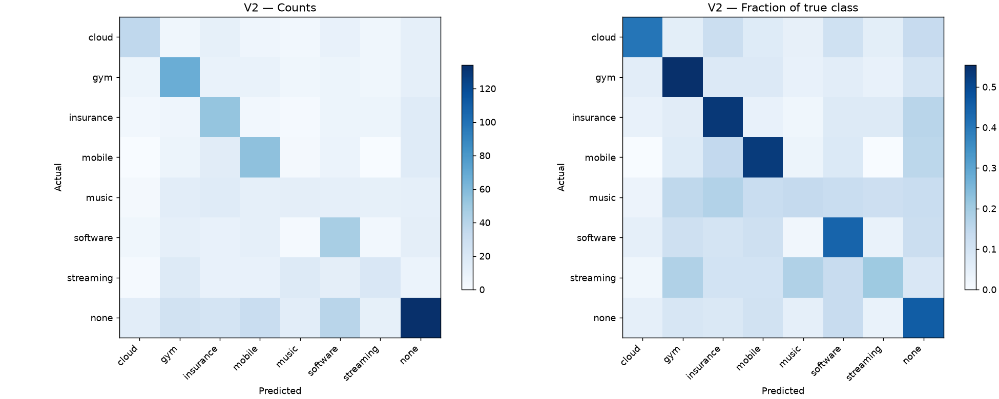
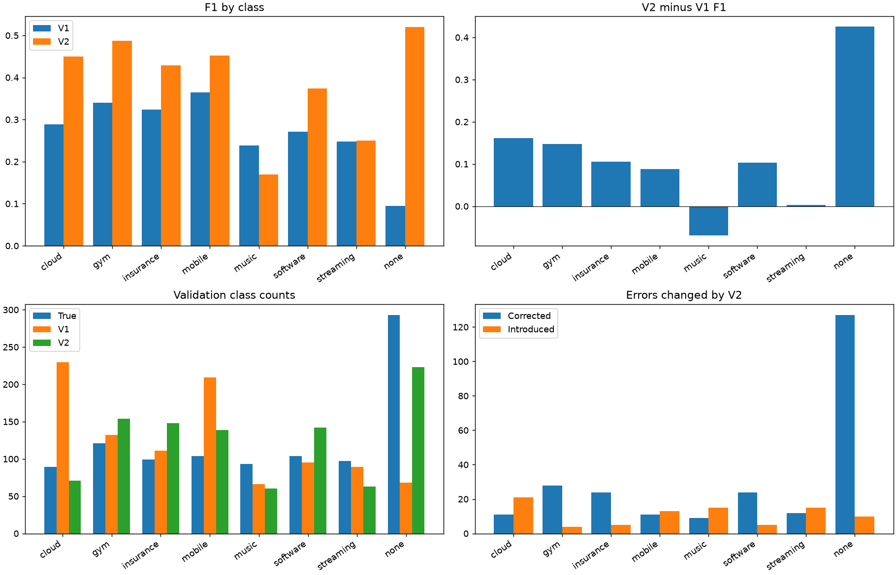

# V1 vs V2 Comparison

## Versions and artifacts compared

V1: `0199a8b7c8b2c790a9d3447b156f2088708c2864`; V2: `96409b7940a991fbda5235b85ffeb40652a4087b`. El informe V2 remoto identifica explícitamente
0199a8b como baseline y describe 0.391549456 para la mezcla final. Ambas versiones se ejecutaron
desde worktrees detached del commit exacto. Los informes históricos orientaron la identificación;
las métricas de este informe se recalcularon de las predicciones frescas y etiquetas oficiales.

Inventario de CSV locales:

| path | kind | sha256 | schema_validation |
| --- | --- | --- | --- |
| data/raw/ubs_2026/sample_submission.csv | C: template, not truth | 53a24cd23d680c2573f5b048dd69d1747f20adc45e308593d914ee13e8d00ed2 | NOT A TEST SUBMISSION |
| outputs/metrics/v1_benchmark/v1/submission.csv | B: test predictions; labels unavailable | b67d364e207d297b1a4d5898f0c37b6f62289cf56808882f5bdcfeb6c5795b0f | PASS |
| outputs/metrics/v1_benchmark/v2/submission.csv | B: test predictions; labels unavailable | da1314cfdea23ffea7756ff82db4e7d4efe77c6fcaf33cb0b66a689795f59adc | PASS |
| outputs/metrics/v1_benchmark/v2/validation_predictions.csv | A: validation predictions | 57ca783d554b9aea6602f1046582dc18c93ddfe5d418ba50173ab1e36cb9313a | NOT A TEST SUBMISSION |
| outputs/predictions/milestone1_carles.csv | B: test predictions; labels unavailable | 17d0ecc6667b8e0e6f54fa345366cfef083d106de769961dcb7e2fc2695ce3f7 | PASS |
| outputs/predictions/submission_carles_entrega_v1.csv | B: test predictions; labels unavailable | b67d364e207d297b1a4d5898f0c37b6f62289cf56808882f5bdcfeb6c5795b0f | PASS |
| outputs/predictions/submission_v1_audit_20260924.csv | B: test predictions; labels unavailable | eb0c47b1b406e441dde0183f65737fdf8e24dd47bc97d4c18c9522a00789e1c5 | PASS |
| outputs/predictions/submission_v1_m2_internal_20260924.csv | B: test predictions; labels unavailable | 994ef9b3838dc36514346ee9367bc1e6d54f80db70e060337ab9ccc1cbf4ee7f | PASS |
| outputs/predictions/temporal_v2_v1_reproduction.csv | B: test predictions; labels unavailable | b67d364e207d297b1a4d5898f0c37b6f62289cf56808882f5bdcfeb6c5795b0f | PASS |

## Protocol comparability

Split oficial: 2.000 clientes train, 1.000 valid, 1.000 test; cutoff UTC 2026-01-01;
horizonte objetivo 90 días. Macro-F1 es media simple de ocho F1, F1_c=2TP/(2TP+FP+FN),
zero_division=0. Alineación por client_id comprobada, no por posición accidental.
V1 seleccionó configuración en valid. V2 también fue seleccionada mediante experimentos sobre ese
valid. Comparación descriptiva justa en el mismo conjunto; no evaluación independiente ni estimación
garantizada del leaderboard. El CSV de test carece de etiquetas y no permite calcular accuracy/F1.


## Historical vs reproduced metrics

Histórico V1: .2710243/.266; histórico V2: .391549456/.424. Valores frescos:

| metric | V1 | V2 | delta |
| --- | --- | --- | --- |
| macro_f1 | 0.271024 | 0.391549 | 0.120525 |
| accuracy | 0.266000 | 0.424000 | 0.158000 |

## Overall metrics

| metric | V1 | V2 | delta |
| --- | --- | --- | --- |
| macro_f1 | 0.271024 | 0.391549 | 0.120525 |
| accuracy | 0.266000 | 0.424000 | 0.158000 |

## Per-class metrics

| class | support | V1 predicted | V2 predicted | V1 precision | V2 precision | delta precision | V1 recall | V2 recall | delta recall | V1 F1 | V2 F1 | delta F1 | corrected | introduced |
| --- | --- | --- | --- | --- | --- | --- | --- | --- | --- | --- | --- | --- | --- | --- |
| cloud | 89 | 230 | 71 | 0.200000 | 0.507042 | 0.307042 | 0.516854 | 0.404494 | -0.112360 | 0.288401 | 0.450000 | 0.161599 | 11 | 21 |
| gym | 121 | 132 | 154 | 0.325758 | 0.435065 | 0.109307 | 0.355372 | 0.553719 | 0.198347 | 0.339921 | 0.487273 | 0.147352 | 28 | 4 |
| insurance | 99 | 111 | 148 | 0.306306 | 0.358108 | 0.051802 | 0.343434 | 0.535354 | 0.191919 | 0.323810 | 0.429150 | 0.105340 | 24 | 5 |
| mobile | 104 | 209 | 139 | 0.272727 | 0.395683 | 0.122956 | 0.548077 | 0.528846 | -0.019231 | 0.364217 | 0.452675 | 0.088458 | 11 | 13 |
| music | 93 | 66 | 60 | 0.287879 | 0.216667 | -0.071212 | 0.204301 | 0.139785 | -0.064516 | 0.238994 | 0.169935 | -0.069059 | 9 | 15 |
| software | 104 | 95 | 142 | 0.284211 | 0.323944 | 0.039733 | 0.259615 | 0.442308 | 0.182692 | 0.271357 | 0.373984 | 0.102627 | 24 | 5 |
| streaming | 97 | 89 | 63 | 0.258427 | 0.317460 | 0.059033 | 0.237113 | 0.206186 | -0.030928 | 0.247312 | 0.250000 | 0.002688 | 12 | 15 |
| none | 293 | 68 | 223 | 0.250000 | 0.600897 | 0.350897 | 0.058020 | 0.457338 | 0.399317 | 0.094183 | 0.519380 | 0.425197 | 127 | 10 |

## Confusion matrices

### V1

| actual / predicted | cloud | gym | insurance | mobile | music | software | streaming | none |
| --- | --- | --- | --- | --- | --- | --- | --- | --- |
| cloud | 46 | 5 | 5 | 15 | 4 | 3 | 7 | 4 |
| gym | 20 | 43 | 5 | 20 | 5 | 12 | 5 | 11 |
| insurance | 16 | 11 | 34 | 14 | 2 | 8 | 8 | 6 |
| mobile | 12 | 4 | 11 | 57 | 1 | 4 | 5 | 10 |
| music | 13 | 12 | 9 | 21 | 19 | 5 | 6 | 8 |
| software | 19 | 13 | 8 | 13 | 8 | 27 | 9 | 7 |
| streaming | 15 | 13 | 6 | 26 | 3 | 6 | 23 | 5 |
| none | 89 | 31 | 33 | 43 | 24 | 30 | 26 | 17 |

### V2

| actual / predicted | cloud | gym | insurance | mobile | music | software | streaming | none |
| --- | --- | --- | --- | --- | --- | --- | --- | --- |
| cloud | 36 | 5 | 11 | 6 | 4 | 10 | 5 | 12 |
| gym | 7 | 67 | 9 | 9 | 5 | 7 | 5 | 12 |
| insurance | 4 | 6 | 53 | 4 | 2 | 7 | 7 | 16 |
| mobile | 0 | 7 | 15 | 55 | 3 | 8 | 0 | 16 |
| music | 3 | 14 | 16 | 12 | 13 | 12 | 11 | 12 |
| software | 5 | 12 | 10 | 12 | 2 | 46 | 4 | 13 |
| streaming | 2 | 17 | 10 | 10 | 17 | 13 | 20 | 8 |
| none | 14 | 26 | 24 | 31 | 14 | 39 | 11 | 134 |



## Prediction changes

| both_correct | only_v1_correct | only_v2_correct | both_wrong | same_prediction | different_prediction |
| --- | --- | --- | --- | --- | --- |
| 178 | 88 | 246 | 488 | 410 | 590 |

## Errors corrected by V2

| class | corrected |
| --- | --- |
| cloud | 11 |
| gym | 28 |
| insurance | 24 |
| mobile | 11 |
| music | 9 |
| software | 24 |
| streaming | 12 |
| none | 127 |

## Errors introduced by V2

| class | introduced |
| --- | --- |
| cloud | 21 |
| gym | 4 |
| insurance | 5 |
| mobile | 13 |
| music | 15 |
| software | 5 |
| streaming | 15 |
| none | 10 |

## None transitions

| class | support | V1 predicted | V2 predicted | V1 precision | V2 precision | delta precision | V1 recall | V2 recall | delta recall | V1 F1 | V2 F1 | delta F1 | corrected | introduced |
| --- | --- | --- | --- | --- | --- | --- | --- | --- | --- | --- | --- | --- | --- | --- |
| none | 293 | 68 | 223 | 0.250000 | 0.600897 | 0.350897 | 0.058020 | 0.457338 | 0.399317 | 0.094183 | 0.519380 | 0.425197 | 127 | 10 |

| positive_to_none | none_to_positive | true_none_corrected | true_none_regressed |
| --- | --- | --- | --- |
| 206 | 51 | 127 | 10 |

none es una clase real, no abstención. V1 la penaliza con bias=-1 pese a ser la más frecuente.

## Architecture and feature differences

V2 fija CatBoost balanceado (300 iteraciones, profundidad 4, learning_rate=.05,
seed=42, cuatro threads) sobre **146 features de historia sin etiquetas**. Excluye las 72 family_*.
Combina .75 probabilidades CatBoost + .25 heurístico de periodicidad, bias=-1/T=1.
El mapa supervisado separado solo se usa para inferencia en clientes excluidos de fit.
`IntegratedV2Model.predict_components` rechaza solapamiento con clientes de entrenamiento.
Código inspeccionado en el worktree V2: `ubs/v2.py`, `ubs/temporal_features.py`, `scripts/run_ubs_v2.py`.
No se reintegraron ramas ni se hizo tuning nuevo.


## Evidence from existing ablations

V1 es un control reproducible e interpretable con buen recall relativo en algunas familias,
pero falla especialmente en none. La codificación supervisada in-sample afecta a los candidatos ML;
no invalida automáticamente la inferencia del heurístico sobre clientes valid excluidos del fit.
V2 gana globalmente en este valid reutilizado. Music retrocede; streaming apenas mejora en F1.
El informe de integración contiene ablations: history CatBoost .383950488 y blend .391549456;
el pequeño delta de mezcla .007598968 no prueba por sí solo generalización. No se reejecutaron esas
ablations en este encargo. La comparación final no identifica causalmente cuánto aporta cada cambio.


## Runtime and complexity

V1 runner completo: 237.35 s. V2 fit+refit: 227.12 s. Son costes end-to-end de trabajos diferentes: V1 incluye selección completa y V2 receta congelada.
Se ejecutaron concurrentemente, por lo que estos tiempos no constituyen un benchmark aislado de latencia.
Los tiempos por candidato V1 se incluyen en la tabla de experimentos.


## Leakage and selection bias

| Severidad | Evidencia / ubicación | Consecuencia | Estado y recomendación |
| --- | --- | --- | --- |
| Alta | models.RecurrenceHeuristic.tune recibe x_valid/y_valid; runner selecciona modelos/alpha sobre valid | Métrica de selección optimista; no es prueba independiente | Histórico preservado. Reservar un test nuevo o evaluación interna separada |
| Alta | ClientFeatureBuilder.fit usa etiquetas train; transform(train) reutiliza el mismo mapa | Candidatos LR/CatBoost reciben codificación influida por su propia etiqueta | No atribuir este mecanismo a filtración de etiquetas valid en el ganador heurístico; V2 elimina 72 columnas del ML |
| Media | data.py exige timestamps < cutoff e IDs disjuntos; ver tabla de controles | Reduce filtración temporal y entre clientes | Controles ejecutados; no prueba absoluta de ausencia de leakage |
| Media | Importes generales y streams mezclan monedas nominales | Scores de estabilidad no equivalen a magnitudes monetarias comparables | No corregido en reproducción; ya existen momentos por moneda |
| Media | features._add_recurrence_features retorna antes si streams.empty | Esquema incompleto en datos sin recurrencias; posible KeyError heurístico | No ocurre en datos oficiales de esta ejecución; agregar fallback en futuro |
| Media | Intervalos no deduplicados; dos eventos dan std=0 | Regularidad aparente con evidencia escasa | Riesgo de robustez, no prueba de leakage |
| Baja | cutoff/target/recent_windows declarados en config pero definidos por constantes del código | Config puede aparentar flexibilidad que no tiene | Documentar las constantes efectivas |
| Control | Vocabulario, imputer, scaler, TF-IDF ajustados con train; IDs solo índice | No se observó fit de estos componentes con valid/test | Inspección de código, no auditoría de todo futuro cambio |
| Control | Refit train+valid separado del scoring | Etiquetas valid autorizadas para modelo final test | Nunca puntuar refit sobre valid como holdout |

No se modificó el predictor para maquillar o corregir V1. No hay test oculto etiquetado local.
No se fabricaron targets históricos: la etiqueta por cliente de enero no etiqueta cada transacción.


## Submission validation

| version | rows | unique_ids | status | sha256 |
| --- | --- | --- | --- | --- |
| v1 | 1000 | 1000 | PASS | b67d364e207d297b1a4d5898f0c37b6f62289cf56808882f5bdcfeb6c5795b0f |
| v2 | 1000 | 1000 | PASS | da1314cfdea23ffea7756ff82db4e7d4efe77c6fcaf33cb0b66a689795f59adc |

Test: 380 predicciones coinciden; 620 difieren. No se conoce cuál acierta.

Se validaron columnas exactas, IDs únicos, cobertura, orden sample, ausencia de nulos y vocabulario.
Submissions reproducidas: `outputs/metrics/v1_benchmark/v1/submission.csv` y `v2/submission.csv`.
No son prueba de que el CSV enviado al dashboard sea el mismo: no se recibió un adjunto CSV en esta tarea.
El informe remoto declara SHA V1 b67d364e207d297b1a4d5898f0c37b6f62289cf56808882f5bdcfeb6c5795b0f
y V2 da1314cfdea23ffea7756ff82db4e7d4efe77c6fcaf33cb0b66a689795f59adc; cotejar con tabla.


## What improved with evidence

| metric | V1 | V2 | delta |
| --- | --- | --- | --- |
| macro_f1 | 0.271024 | 0.391549 | 0.120525 |
| accuracy | 0.266000 | 0.424000 | 0.158000 |



## What cannot be concluded

No puede calcularse F1 sobre test sin etiquetas, ni atribuir causalmente todo el delta a una sola feature, ni interpretar el valid reutilizado como evaluación independiente.

## Final recommendation

V2 supera V1 localmente bajo protocolo comparable. Conservar ambas recetas congeladas y comunicar sus limitaciones.

```powershell
.\.venv\Scripts\python.exe scripts/reproduce_v1_benchmark.py --version v1
.\.venv\Scripts\python.exe scripts/reproduce_v1_benchmark.py --version v2
.\.venv\Scripts\python.exe scripts/analyze_v1_baseline.py
.\.venv\Scripts\python.exe -m pytest -q
```
Los scripts fijan commits, crean worktrees detached bajo outputs ignorados y copian los seis archivos de datos.
No cambian la rama activa ni sobrescriben las submissions originales. Las rutas de salida son la única
modificación de configuración V1. Logs, predicciones por cliente y manifests quedan en
`outputs/metrics/v1_benchmark/`. Reejecutar sustituye únicamente esos outputs de reproducción.
